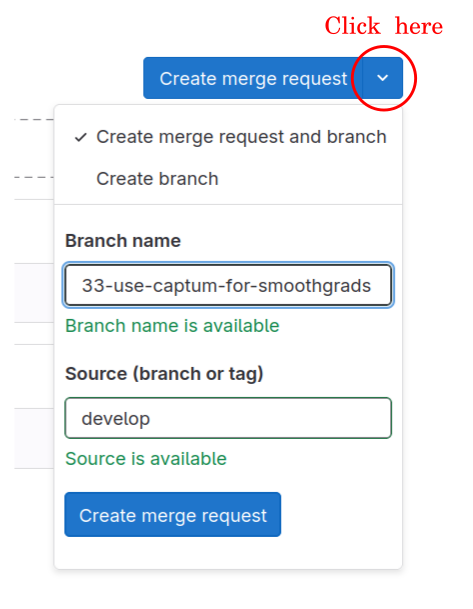

# Contributing to CaBRNet

First of all, thank you for your interest in contributing to CaBRNet! 
To be able to contribute, you will require either a [GitHub](https://github.com) account or directly 
a [Frama-C gitlab](https://git.frama-c.com) account. If you are using a GitHub account, you will have to authorize your 
information to be shared to the Frama-C gitlab server, then wait for a Frama-C admin to enable your account (this may take
a few days depending on opening days).

Contributions can take many forms:

1. Requesting a bug-fix. In this case, we suggest that you:
   1. Check whether this bug has not been already reported in the [issue list](https://git.frama-c.com/pub/cabrnet/issues).
   2. Create a new issue, preferably with a Minimal Reproducible Example (MRE) to help us identify the origin of the problem.
2. Requesting a small feature that does not require important library changes (*e.g.* no major changes in the API, no additional packages). In this case, we suggest that you:
   1. Check whether this feature has not been already suggested in the [issue list](https://git.frama-c.com/pub/cabrnet/issues).
   2. Create a new issue, describing the requested feature, with as many details as possible.
3. Requesting a feature that may involve major changes to the library (API, dependencies, etc.). 
In this case, we suggest that you:
   1. Check whether this feature has not been already suggested in the [issue list](https://git.frama-c.com/pub/cabrnet/issues).
   2. Create a new issue, describing the requested feature, with as many details as possible, along with a 
**design plan** that should contain the foreseeable impact of the feature on the library. This design plan will be reviewed
by the team to establish the feasibility of the development.
4. Proposing an implementation of a bug-fix or a feature. In this case, we suggest to you:
   1. Create the issue if it is not already present in the [issue list](https://git.frama-c.com/pub/cabrnet/issues)
   2. Create a merge request **from the `develop` branch** (see example below)



## Development installation and process

To install everything necessary for developing new CaBRNet features, run
```bash
git clone https://git.frama-c.com/pub/cabrnet.git
```
Then, follow the [installation guide](docs/manuals/install.md) to install all dependencies.

#### Code Style

CaBRNet uses [black](https://pypi.org/project/black/ to ensure a common code style across the entire code base.
Black can be installed locally using:  
```bash
python3 -m pip install black
```
As indicated in `pyproject.toml`, CaBRNet uses a maximum line length of 120 (this configuration should be 
automatically taken into account when using a development environment such as [PyCharm](https://www.jetbrains.com/pycharm/)).

#### Type Hints

CaBRNet is (almost) fully typed using Python 3.6+ [type hints](https://www.python.org/dev/peps/pep-0484/).

#### Unit Tests

To implement unit tests, please use python's [`unittest`](https://docs.python.org/3/library/unittest.html). 

#### Documentation

Each new feature added to CaBRNet should be properly documented:

- inside the code itself. We strongly encourage developers to leave as many (relevant) comments inside their code
to improve the comprehension of the reader and simplify the review process
- inside the user manual located in the [docs/manuals](docs/manuals) folder.

CaBRNet uses `pydoc-markdown` to generate the markdown API reference:
```bash
cd docs/
pydoc-markdown
```
and mkdocs to generate the documentation website:
```bash
mkdocs build -f docs/mkdocs.yml
```

## License

By contributing to CaBRNet, you agree that your contributions will be licensed
under the LICENSE file in the root directory of this source tree.
