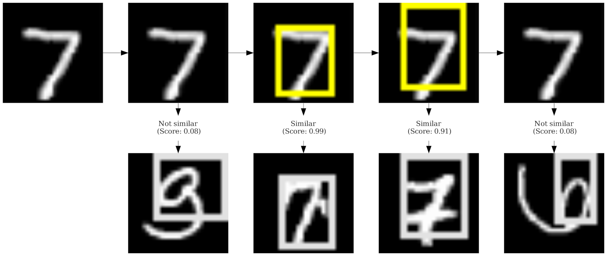

CaBRNet is an open source library that offers an API to use state-of-the-art
prototype-based architectures (also called case-based reasoning models), or easily add a new one.

Currently, CaBRNet supports the following architectures:
- **ProtoPNet**, as described in *Chaofan Chen, Oscar Li, Chaofan Tao, Alina Jade Barnett,
Jonathan Su and Cynthia Rudin.* [This Looks like That: Deep Learning for Interpretable Image Recognition](https://proceedings.neurips.cc/paper_files/paper/2019/file/adf7ee2dcf142b0e11888e72b43fcb75-Paper.pdf). 
Proceedings of the 33rd International Conference on Neural Information Processing Systems, page 8930–8941, 2019.
- **ProtoTree**, as described in *Meike Nauta, Ron van Bree and Christin Seifert.* [Neural Prototype Trees for Interpretable Fine-grained Image
Recognition](https://openaccess.thecvf.com/content/CVPR2021/papers/Nauta_Neural_Prototype_Trees_for_Interpretable_Fine-Grained_Image_Recognition_CVPR_2021_paper.pdf). 
2021 IEEE/CVF Conference on Computer Vision and Pattern Recognition (CVPR), pages 14928–14938, 2021.
# Build and install
## How to install all dependencies
With `pip`:

```bash
python3 -m venv venv
source venv/bin/activate
python3 -m pip install -r requirements.txt -e .
```

With `conda`/`mamba`:

```bash
conda env create -f environment.yml
conda activate cabrnet
python3 -m pip install -e .
```

or

```bash
mamba env create -f environment.yml
mamba activate cabrnet
python3 -m pip install -e .
```

With `micromamba`:

```bash
micromamba create -f environment.yml
micromamba activate cabrnet
python3 -m pip install -e .
```

## Building the package
Once the dependencies are downloaded, the CaBRNet package can be built from `pyproject.toml` as follows: 
```bash
python3 -m build
```
NOTE: this operation requires the  `build` python package.

# CaBRNet applications
All CaBRNet applications are accessible through a single front-end script. To list all available applications, simply enter:
```bash
cabrnet --help
```
```
usage: cabrnet [-h] {download_examples,evaluate,train,import,explain,explain_global} ...

CaBRNet front-end

positional arguments:
  {download_examples,evaluate,train,import,explain,explain_global}
                        sub-command help
    download_examples   download example models
    evaluate            evaluate a CaBRNet classifier
    train               train a CaBRNet classifier
    import              convert an existing legacy model into a CaBRNet version
    explain_local       explain the decision of a CaBRNet classifier
    explain_global      explain the global behaviour of a CaBRNet classifier

options:
  -h, --help            show this help message and exit
```
To obtain the documentation for a specific application, simple enter `cabrnet <app_name> --help`, *e.g.*:
```bash
cabrnet train --help
```
Although CaBRNet already supports most applications required to build, train, evaluate and explain prototype-based models. 
it is also easy to [add new applications](src/apps/applications.md).

## Common options
Some options are present in all applications:
- `--version|-V` allows to check the version of the CaBRNet library.
- `--device DEVICE` allows to specify a target hardware device (by default, it is set to `cuda:0`).
- `--seed|-s SEED` allows to specify the random seed to improve the [reproductibilty](#reproducibility) of all 
experiments (by default, it is set to 42, as it should be ;)).
- `--logger-level LOGGER_LEVEL` indicates the level of debug message displayed on the standard output. 
CaBRNet uses [loguru](https://loguru.readthedocs.io/en/stable/) for logging messages.
- `--verbose` enables [tqdm](https://tqdm.github.io/) progression bars during long operations.

## Training 
`cabrnet train` is used to train a prototype-based model.
- `--model-config /path/to/file.yml` indicates how to [build and initialize the model](src/cabrnet/generic/model.md).
- `--dataset|-d /path/to/file.yml` indicates how to [load and prepare the data for training](src/cabrnet/utils/data.md).
- `--training|-t /path/to/file.yml` indicates the [training parameters of the model](src/cabrnet/utils/optimizers.md).
- `--visualization /path/to/file.yml` indicates how to visualize the prototypes and patches of test image (TODO).
- `--save-best acc|loss` indicates how to determine the "best" model, based either on accuracy (`acc`) or `loss`.
- `--output-dir path/to/output/directory` indicates where to store the model checkpoints during training.

### Sanity check
For a quick sanity check of a particular architecture or overall training configuration, it is possible to use the 
`--sanity-check-only` option that only processes 5 batches per training epoch. 

### Resuming computations
CaBRNet provides options to save training checkpoints and resuming the training process from a given checkpoint.
- `--checkpoint-frequency num_epochs` indicates the frequency of checkpoints (in number of epochs). 
If not provided, **only the best model is kept during training** (in the `best/` subdirectory)
- `--resume-from /path/to/checkpoint/directory` indicates where the training process should resume. 
If not provided, the training process starts from the first epoch.
- To avoid inadvertently erasing a previous training run, CaBRNet will abort the training process if the output 
directory already exists. To override this check, use the `--overwrite` option.

### Training process

CaBRNet assumes that the high-level training process is common to all prototype-based architectures:
- The model is initialized, usually from a pre-trained convolutional neural network that is used as a feature extractor 
(backbone), and with random prototypes.
- The model is trained for several epochs, modifying the values of the prototypes and the weights of the backbone.
- The prototypes are *projected* to their closest vectors from a projection dataset (usually the training set).
- The visualization of each prototype is generated and stored in the `prototypes/` subdirectory.
- An optional *epilogue* takes place, usually to prune weak prototypes.

## Importing a legacy model
To avoid restarting previous computations performed using the codes provided by the original authors,
CaBRNet offers a tool to import an existing dictionary into the new format, using the `cabrnet import` command.
Currently, this tool only supports ProtoPNet and ProtoTree.

Here is a short description of the options. As in `cabrnet train`:
- `--model-config /path/to/file.yml` indicates how to [build the model](src/cabrnet/generic/model.md). In addition,
`--model-state-dict /path/to/model/state.pth` indicates the location of the legacy state dictionary that should be used 
to initialize the model.
- `--output-dir path/to/output/directory` indicates where to store the imported model.
Note that after the loading the CaBRNet model with the parameters of the legacy model (feature extractor, prototypes, etc),
CaBRNet **finalizes the import process by projecting and extracting the prototypes** and performing the optional epilogue if necessary.
Therefore, the `cabrnet import` tool also requires the following information:
- `--dataset|-d /path/to/file.yml` indicates how to [load and prepare the data for prototype projection](src/cabrnet/utils/data.md).
- `--training|-t /path/to/file.yml` indicates the [parameters of the epilogue](src/cabrnet/utils/optimizers.md) (if any).
- `--visualization /path/to/file.yml` indicates how to visualize the prototypes (TODO).


## Evaluating a CaBRNet model
After training, it is possible to evaluate the loss and accuracy of a model using the `cabrnet evaluate` tool. 
To evaluate a model, the tool uses the following options:
- `--model-config /path/to/file.yml` indicates how to [build the model](src/cabrnet/generic/model.md). In addition,
`--model-state-dict /path/to/model/state.pth` or `--legacy-state-dict /path/to/model/state.pth` indicate 
the location of a CaBRNet or legacy state dictionary that should be used to initialize the model.
- `--dataset|-d /path/to/file.yml` indicates how to [load and prepare the test data for the evaluation](src/cabrnet/utils/data.md).

## Generating explanations
Prototype-based architectures provide both global and local explanations:
- global explanations provide an overview of the decision-making process of the entire model.
- local explanations provide information regarding a particular decision (for a particular image). 
### Global explanations
A global explanation is generated using the `explain_global` method of a CaBRNet model (see the 
[ProtoTree example](src/cabrnet/prototree/model.py)). To generate such an explanation, the tool uses the following options:
- `--model-config /path/to/file.yml` and `--model-state-dict /path/to/model/state.pth` indicate how to 
[build and initialize the model](src/cabrnet/generic/model.md).
- `--prototype-dir path/to/prototype/directory` indicates where the prototype visualizations extracted during 
[training](#training-) are stored (usually in `<training_directory>/prototypes/`).
- `--output-dir path/to/output/directory` indicates where to store the global explanation.
### Local explanations
A local explanation is generated using the `explain` method of the CaBRNet model (see the 
[ProtoTree example](src/cabrnet/prototree/model.py)). To generate such an explanation, the tool uses the following options:
- `--model-config /path/to/file.yml` and `--model-state-dict /path/to/model/state.pth` indicate how to 
[build and initialize the model](src/cabrnet/generic/model.md).
- `--image path/to/image` indicates which image should be classified by the model. 
- `--dataset|-d /path/to/file.yml` indicates how to [prepare the image](src/cabrnet/utils/data.md) before it is processed by the model,
based on the transformations applied to the *test* dataset.
- `--visualization /path/to/file.yml` indicates how to visualize the patches of the test image (TODO).
- `--prototype-dir path/to/prototype/directory` indicates where the prototype visualizations extracted during 
[training](#training-) are stored (usually in `<training_directory>/prototypes/`).
- `--output-dir path/to/output/directory` indicates where to store the local explanation.

# Example: ProtoTree / MNIST
## Training
```bash
cabrnet --device cpu --seed 42 --verbose --logger-level INFO train \
  --model-config configs/prototree/mnist/model.yml \
  --dataset configs/prototree/mnist/data.yml \
  --training configs/prototree/mnist/training.yml \
  --training-dir runs/mnist_prototree \
  --visualization configs/prototree/mnist/visualization.yml
```
This command trains a ProtoTree during one epoch, and stores the resulting checkpoint in 
`runs/mnist_prototree/final`.

## Global explanation
```bash
cabrnet --verbose explain_global \
  --model-config runs/mnist_prototree/final/model.yml \
  --model-state-dict runs/mnist_prototree/final/model_state.pth \
  --output-dir runs/mnist_prototree/global_explanation \ 
  --prototype-dir runs/mnist_prototree/prototypes/ 
```
This command generates a global explanation for the ProtoTree model and stores the result in 
`runs/mnist_prototree/global_explanation`.


## Local explanation
```bash
cabrnet --verbose explain \
  --model-config runs/mnist_prototree/final/model.yml  \
  --model-state-dict runs/mnist_prototree/final/model_state.pth \
  --dataset configs/prototree/mnist/data.yml \
  --visualization configs/prototree/mnist/visualization.yml \
  --prototype-dir runs/mnist_prototree/prototypes/ \
  --output-dir runs/mnist_prototree/local_explanations/  \
  --image examples/images/mnist_sample.png
```
This command generates a local explanation for the image stored in `examples/images/mnist_sample.png` and stores the result in 
`runs/mnist_prototree/local_explanation`.



## Reproducibility
### Random number initialization and deterministic operations
For reproducibility purposes, CaBRNet explicitly uses a random `seed` to initialize the various random number 
generators that may be used during the training process, as shown [here](src/main.py).
```python
import numpy as np
import torch
import random

seed = 42
torch.use_deterministic_algorithms(mode=True)
torch.manual_seed(seed)
np.random.seed(seed)
random.seed(seed)
```
Additionally, CaBRNet use a pytorch feature called [torch.use_deterministic_algorithm](https://pytorch.org/docs/stable/generated/torch.use_deterministic_algorithms.html),
which ensures reproducible results for a given hardware/software configuration. IMPORTANT NOTE: for compatibility reasons,
it might be necessary to manually set the `CUBLAS_WORKSPACE_CONFIG` environment variable before launching the CaBRNet 
main tool.
```bash
export CUBLAS_WORKSPACE_CONFIG=:16:8
```
### Resuming a training process
CaBRNet allows the training process to generate *checkpoints* (using the `--checkpoint-frequency` option), so that 
the entire training process can be resumed from any epoch, under the same conditions and - therefore - with the same outcome.
More precisely, each training checkpoint contains:
- a copy of the YML file describing the model architecture, as specified [here](src/cabrnet/generic/model.md).
- a copy of the YML file describing the dataset, as specified [here](src/cabrnet/utils/data.md). 
- a copy of the YML file describing the training configuration, as specified [here](src/cabrnet/utils/optimizers.md). 
- the current model state dictionary.
- the current state of all optimizers and learning rate schedulers.
- a file `state.pickle` containing auxiliary information such as:
  - the index of the current epoch.
  - the hardware device used.
  - the current best metrics (*e.g.* accuracy or cross-entropy loss).
  - the random seed used originally.
  - the internal state of each random number generator (torch, numpy and python). 

In other words, from a given checkpoint, random number generators are not reset using the original random seed but 
rather restored to their appropriate state with respect to the current epoch.