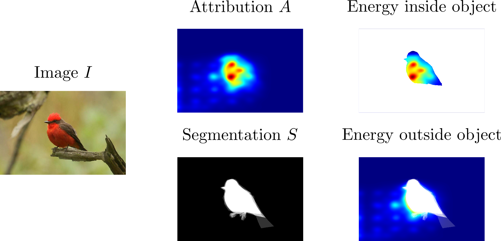
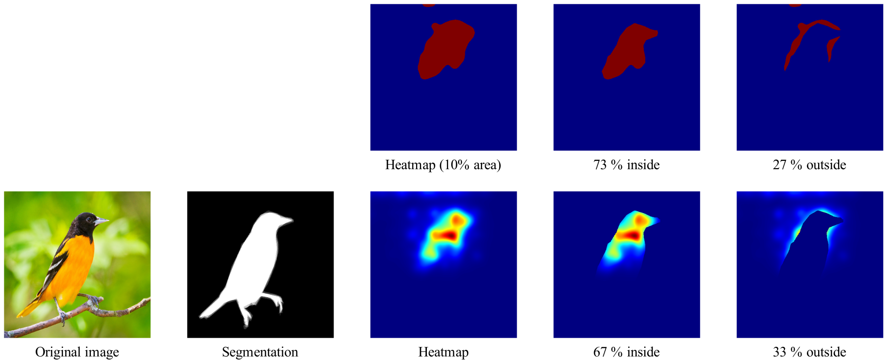
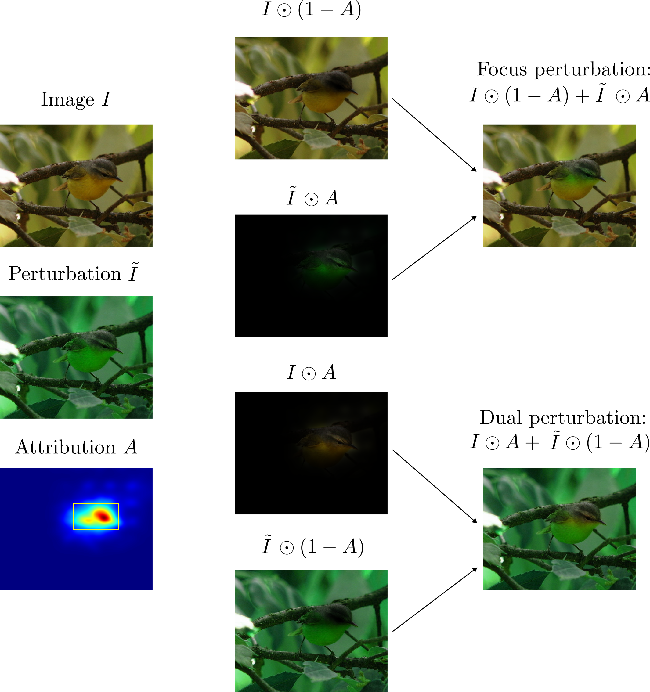
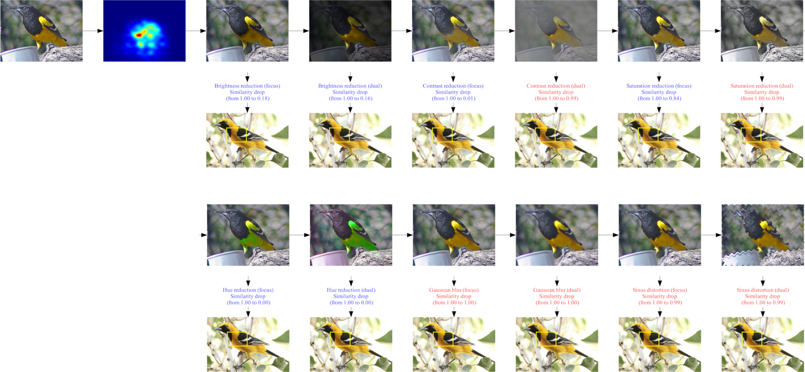
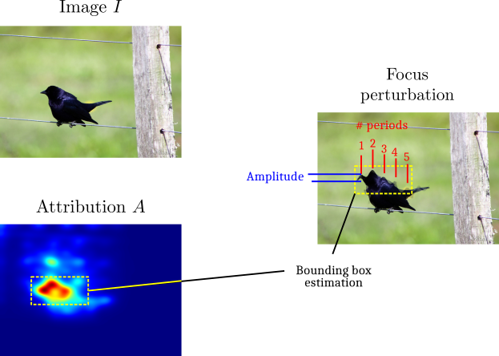

# Evaluating models

To go beyond the evaluation of the accuracy of case-based reasoning models,
CaBRNet implements several metrics for evaluating the quality of prototypes.
Currently, CaBRNet supports metrics that are derived from the following works:

- Sensitivity of prototype similarity to geometric perturbations, as described in *M.Nauta, A.Jutte, J.C.Provoost,
  C.Seifert*,
  [This looks like that, because ... explaining prototypes for interpretable image recognition](https://link.springer.com/chapter/10.1007/978-3-030-93736-2_34),
  PKDD/ECML Workshops, 2020.
- Relevance of prototypes, as described in *R.Xu-Darme, G.Quénot, Z.Chihani, M.-C.Rousset*,
  [Sanity checks for patch visualisation in prototype-based image classification](https://ieeexplore.ieee.org/document/10208853),
  XAI4CV at CVPR (2023).

## Creating and Using Metrics

To add new metrics, simply add a new file `<my_metrics.py>` into the
directory [`core/evaluation`](../../src/cabrnet/core/evaluation).
Such files need to implement two methods,

- `get_config(config_file: Path) -> dict[str, Any] | None` reads the configuration file for this metrics. It corresponds
  to the `-b`/`--benchmark-configuration` parameter of the `benchmark` application.
- `execute(arg1, arg2, ..., **kwargs) -> None:` performs the evaluation of the model. The parameters given to the
  function are the ones in the dictionary returned by `get_config` plus the following parameters, which are derived from
  the parameters of the applications: `model`, `dataset_config`, `visualization_config`, `projection_file`, `root_dir`
  (output directory where the results are to be stored), `device`, `verbose`, `prototype_dir`, and `sampling_ratio`. To
  guarantee robustness with future implementations, it is recommended to use a catch-all `**kwargs` parameter.

The metrics that should be executed are defined in the benchmark configuration file
(parameter `-b`/`--benchmark-configuration`). Each entry in this configuration refers to a python file
from `core/evaluation`, and the sub-entries are the parameters for this specific metrics.

## Existing Metrics

### Evaluating the relevance of a patch of image using the pointing game

#### Description

This metric is inspired by the work of *R.Xu-Darme, G.Quénot, Z.Chihani, M.-C.Rousset*,
[Sanity checks for patch visualisation in prototype-based image classification](https://ieeexplore.ieee.org/document/10208853),
XAI4CV at CVPR (2023).

One key element contributing to the interpretability of a case-based reasoning
model resides in its ability to **correctly locate relevant parts of images where
a visual similarity has been established**, which depends on the choice of
[attribution function](visualize.md) (as shown in R.Xu-Darme *et al*, 2023).

Secondly, in the context of image classification, it can be argued that the decision
of the model should be based on the parts of the object itself inside the image rather than
elements of the background (a cow remains a cow regardless of its environment, be it [a
field of grass or a sandy beach](https://arxiv.org/pdf/1907.02893.pdf)).

Thus, the purpose of the pointing game is to check that:

- Prototypes correspond to parts of the object inside images of the projection set
- When classifying a test image, the model establishes similarities between prototypes and
  parts of the object inside the test image.

In other words, this test evaluates the **relevance** of the patches of images used to compute the decision.
In practice, this test requires knowledge of the object segmentation $S$, which is sometimes provided
in the training dataset (*e.g.* [CUB200](https://www.vision.caltech.edu/datasets/cub_200_2011/)).
As shown below, from the attribution map $A$ and the segmentation $S$, the objective is to compute the
ratio of attribution that falls inside the object segmentation *w.r.t.* to the total attribution.



More precisely, this ratio is computed in two manners:

1) Either by summing the attribution score of all pixels inside the object segmentation and dividing by
   the sum of all attribution scores, as in [Wang *et al*](https://arxiv.org/abs/1910.01279).
   The corresponding score is called the *energy relevance* score of the patch of image.
2) Or by first selecting only the most relevant pixels (according to a set percentage, *e.g.* 10% in the
   example below), then computing the ratio of these pixels inside the object segmentation,
   as in [Xu-Darme *et al.*](https://ieeexplore.ieee.org/document/10208853).
   The corresponding score is called the *mask relevance* score of the patch of image
   (since some pixels are masked out of the computation).



#### Reports

- prototype_info_db: A file containing, for each prototype $P$:

    - The index of the corresponding image $I$ inside the projection set
    - The energy and mask relevance scores of the prototype

- patch_info_db: A file containing, for each test image $I$ and its most similar prototype $P$,
  the energy and mask relevance scores of the patch of $I$ most similar to $P$.

Note that these scores depend on the choice of [attribution function](visualize.md).

#### Configuration

The benchmark is configured in a YML format as follows:

```yaml
relevance_analysis:
  prototype_info_db: <path_to_file> # Path to CSV file containing raw analysis per prototype
  patch_info_db: <path_to_file> # Path to CSV file containing raw analysis per test image
  area_percentage: <val> # Percentage of image area to keep when using a threshold during the pointing game
  debug_mode: <True|False> # If True, saves debug images
  sampling_ratio: <val> # Sampling ratio: only 1 in X images is analyzed
  num_prototypes: <val> # Maximum number of relevant prototypes to analyze per test image
```

### Understanding the nature of similarity through local perturbation analysis

#### Description

This metric is inspired by the work of *M.Nauta, A.Jutte, J.C.Provoost, C.Seifert*,
[This looks like that, because ... explaining prototypes for interpretable image recognition](https://link.springer.com/chapter/10.1007/978-3-030-93736-2_34),
PKDD/ECML Workshops, 2020.

To provide understanding on the *nature* of the similarity between a prototype and a patch of
test image, the authors propose to apply geometric perturbations to the test image and to monitor a possible
drop in the similarity score between this image and the prototype.
For instance, if the similarity between the test image and the prototype drops after applying a color shift
on the test image, then the similarity is likely based on color.
Importantly, if no perturbation leads to a drop in similarity, then the nature
of the similarity is unknown (i.e. based on abstract properties), **which questions the interpretability of the model**.
Note that perturbations are applied on the entire test image, regardless of the location of the most similar patch
identified by the
attribution function (for more information on attribution methods see [here](visualize.md)).

CaBRNet implements a similar measure of a drop in similarity.
However, **it uses the attribution map to apply local (rather than global) perturbations**.
The intuition is that, assuming that the attribution method in use is indeed able to identify the most relevant pixels
in the test
image w.r.t. the similarity score with a given prototype, then:

1) A local perturbation of these pixels should be sufficient to elicit a drop in similarity (assuming
   that the nature of the similarity is indeed tied to this type of perturbation).
2) A perturbation of **all other pixels** (i.e. the least important pixels) should **not** lead to a drop in similarity.

Currently, CaBRNet supports the following types of perturbations:

- Brightness reduction (with parameter `brightness_factor`)
- Contrast reduction (with parameter `contrast_factor`)
- Saturation reduction (with parameter `saturation_factor`)
- Hue shift (with parameter `hue_factor`)
- Gaussian blur (with parameters `gaussian_blur_ksize` and `gaussian_blur_sigma`)
- Sinus distortion (with parameters `distortion_periods`, `distortion_amplitude`, and `distortion_direction`)

In practice, for each image $I$ in a given test dataset, CaBRNet first identifies the
most similar prototype $P$. Then, it creates two images corresponding to a focused and dual perturbation
respectively, using:

- The original image $I$
- The perturbed image $\tilde{I}$, as in Nauta *et al*, 2020
- The attribution map $A$ (normalized between 0 and 1) returned by the chosen attribution method and
  corresponding to the pixels in image $I$ most similar to prototype $P$



Then for each type of perturbation and each pair of images (focused and dual),
CaBRNet measures the drop in similarity score, as shown below:



Importantly, by applying this local (focused) perturbation based on the attribution map,
CaBRNet conditions the interpretability of a case-based reasoning model to:

- Its ability to correctly locate the pixels in the test image that are most similar to a given prototype.
- The existence of *at least* one perturbation leading a drop in similarity, which informs the user on the nature of
  that similarity

#### Reports

- info_db: A file containing, for each test image $I$ and its most similar prototype $P$,
  and for each type of perturbation:

    - The original similarity score between $I$ and $P$
    - The name of the perturbation
    - The similarity score of the focused perturbed image
    - The similarity score of the dual perturbed image

- global stats:

    - The number of covered prototypes (not all may be covered, since a prototype may never be the most similar to any
      of the test images)
    - The average percentage of similarity drop per type of perturbation when applying focused perturbations.

#### Configuration

The benchmark is configured in a YML format as follows:

```yaml
local_perturbation_analysis:
  info_db: <path_to_file> # Path to CSV file containing raw analysis per test image
  global_stats: <path_to_file> # Path to CSV file containing general global stats
  sampling_ratio: <X> # Sampling ratio: only 1 in X images is analyzed
  enable_dual_mode: <True|False> # If True, compute sensitivity test on dual perturbation
  distribution_img: <path_to_image> # Path to output image showing distribution of max similarity drops
  quiet: <True|False> # If True, does not show the distribution image
  debug_mode: <True|False> # If True, saves perturbations (used for debugging purposes)
  num_prototypes: <val> # Maximum number of relevant prototypes to analyze per test image
  perturbations:
    brightness: # first perturbation
      type: brightness
      params:
        brightness_factor: <val>
    complex_perturbation: # second perturbation
      - type: brightness # first op
        params:
          brightness_factor: <val>
      - - type: hue # second op
          params:
            hue_factor: <val>
        - type: blur # third op
          params:
            gaussian_blur_ksize: <val>
            gaussian_blur_sigma: <val>
      - type: contrast # fourth op
        params:
          contrast_factor: <val>
```

This file defines two perturbations, one that includes a single operation (brightness reduction)
and one that includes four operations in specified order.
An atomic operation is defined by a dictionary with key `type` (that specifies the type of operation)
and an optional key `params` (with a dictionary of parameters).
A perturbation with multiple operations (i.e., a complex operation) is defined
by a list of atomic operations and complex operations, recursively.

Note on the sinus distortion: to adapt the intensity of the sinus distortion
to the relative size of the patch inside the image, CaBRNet uses the attribution map $A$
to:

1) Estimate a bounding box encompassing the most relevant pixels
2) Compute the *frequency* of the distortion based on the requested number of periods (5 in the example below)
   and the width of the bounding box.



### Discriminative power of prototypes

Benchmark `prototype_discrimination` evaluates how good individual prototypes are good at classifying images.
This benchmark works by computing the activation of each prototype in each image of a dataset
and applying a AUROC or AUPRC analysis to determine how much the prototype separates the images of its class(es) vs the
images of other classes.

### Consistency

#### Description

This metrics is an implementation of the *consistency* metrics from the 2023 ICCV paper entitled
"*Evaluation and Improvement of Interpretability for Self-Explainable Part-Prototype Networks*"
by Qihan Huang et al.
The idea is to verify whether each prototype can be linked to a specific *part*
that has been recognised by an expert (through an annotation).

Consistency is computed as follows.
For a given prototype $p$ associated with class $k = c(p)$, let $I\sb{k}$ be the images of class $k$.
Let $O\sb{k}$ be the set of *object parts* associated with class $k$
(i.e., parts that are typically present in images of this class)
and let $i \in O\sb{k}$ be one of these parts;
$I\sb{k,i}$ are the images that contain this part,
and for a given image $im \in I\sb{k,O}$, the *location* of the part $i$ in the image is denoted
$(x\sb{im,i},y\sb{im,i})$.
For a given attribution method $v$ and an input image $im$,
we upsample the $H \times W$ activation map to get an attribution map on the whole image,
and find the unit $(x\sb{im,u},y\sb{im,u})$ with maximal attribution.
We then set $o^{p}\sb{im,i}$ to $1$ if the $L1$ distance between $(x\sb{im,u},y\sb{im,u})$
and $(x\sb{im,i},y\sb{im,i})$ is lower than some threshold $s$
(i.e., the prototype activated roughly where the part is).

The *level of consistency* of prototype $p$ is then the maximum proportion --- amongst the parts ---
of proper activation of the prototype:
$$
cons(p) = \max\sb{i \in O\sb{c(p)}}\ \frac{\sum\sb{im \in I\sb{c(p),i}} o^p\sb{im,i}}{|| I\sb{c(p),i}||}.
$$
Finally, a prototype is deemed *consistent* if its level of consistency is above a certain threshold $\mu$.

*Consistency* of the whole model is the proportion of prototypes that are consistent.

#### Configuration

The metrics is configured in a YML format as follows:

```yaml
consistency:
  image_description: data/CUB_200_2011/images.txt
  part_annotations: data/CUB_200_2011/parts/part_locs.txt
  dataset_name: test_set
  load_distances: True # Load saved distances (will not recompute) from $output_folder/distances.csv
  save_distances: False # Set to true to save distances in $output_folder/distances.csv
  half_size: 36
  threshold: 0.8
```

The two files `image_description` and `part_annotations` are used to load the part annotations.
It assumed that `image_description` is a text file with one line per image
and where each line contains `image_idx image_file_path`;
this allows CaBRNet to attribute an index to each image.
It is further assumed that `part_annotations`
is also a text file with one annotation per line,
where each annotation has the form `image_idx part_idx x y visible`
where $(x,y)$ is the location of part `part_idx` in image `image_idx`
if `visible` is `1` (otherwise, the part is not visible in the image).

`dataset_name` is the name of the dataset (from the dataset config file)
used to verify consistency.
`load_distances` and `save_distances` indicate whether the $L1$ distances mentioned before
should be loaded or saved in a csv file
(computing the distances can be time-consuming on non-trivial datasets).

`half_size` refers to the $s$ parameter,
i.e., the attribution is close to the annotation if the distance is less that this value.
Instead of giving an absolute value (here, `36`),
it is possible to provide a float between $0.0$ and $1.0$;
in this case, the parameter $s$ is image-dependent
and equals `half-size` times the size of the image.

`threshold` is the $\mu$ parameter defined above.

The app outputs the average consistency of prototypes
as well as the consistency of the model (i.e., the proportion of prototypes
whose consistency is above the $\mu$ threshold).
It also generates a file `consistencies.csv` that records the consistency of each prototype
and the part that is provided this consistency score.

## Launching the benchmark

Case-based reasoning models are evaluated on these metrics using the [benchmark](cabrnet.md#evaluating-a-cabrnet-model)
application. For simplicity, CaBRNet uses a single YML file containing the configuration of each metric
(see example
provided [here](https://github.com/aiser-team/cabrnet/blob/develop/configs/benchmarks/test_configuration.yml)).


