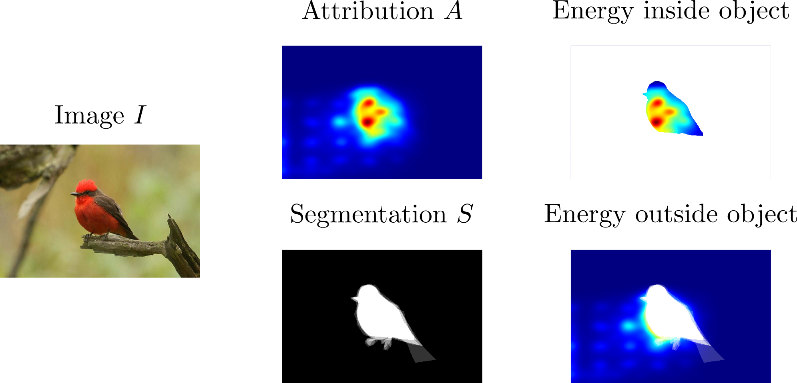
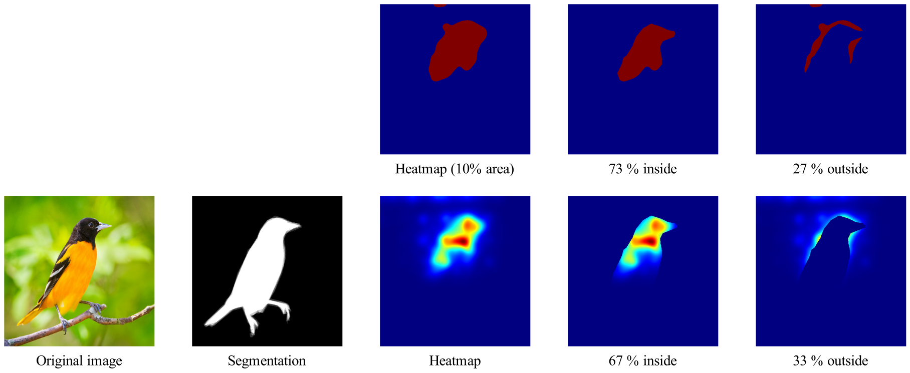
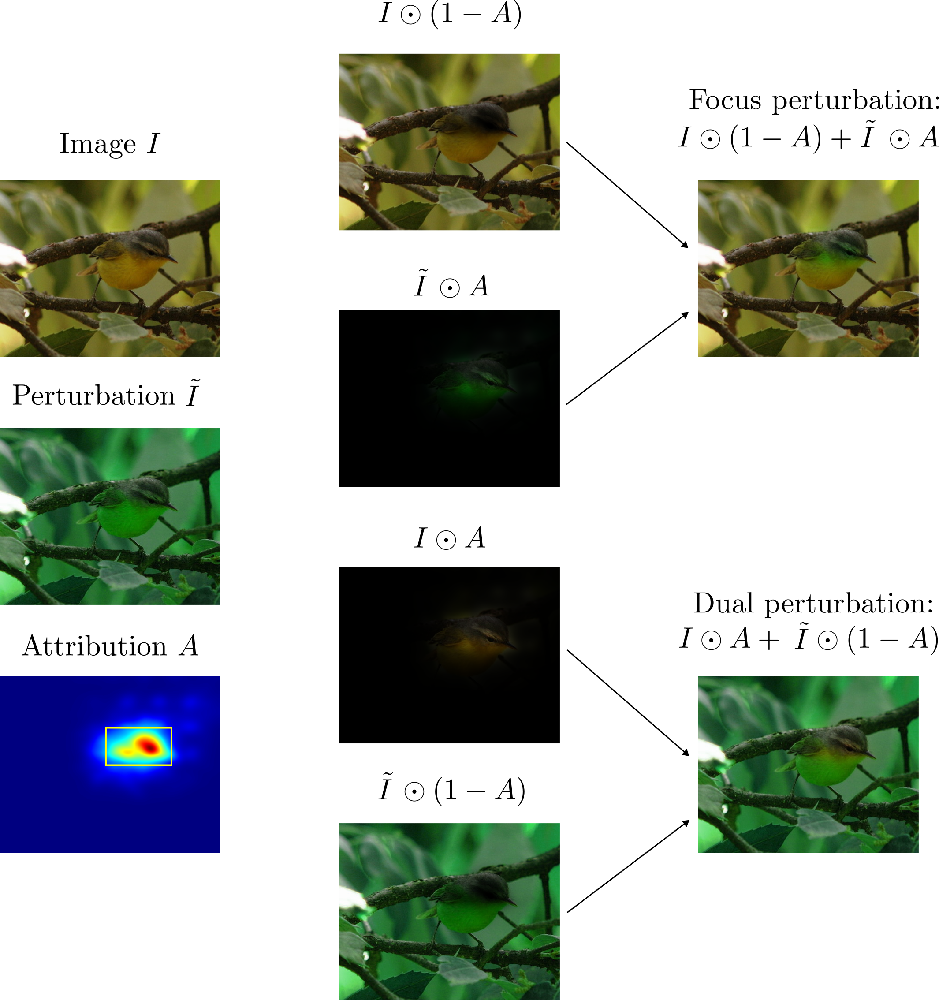
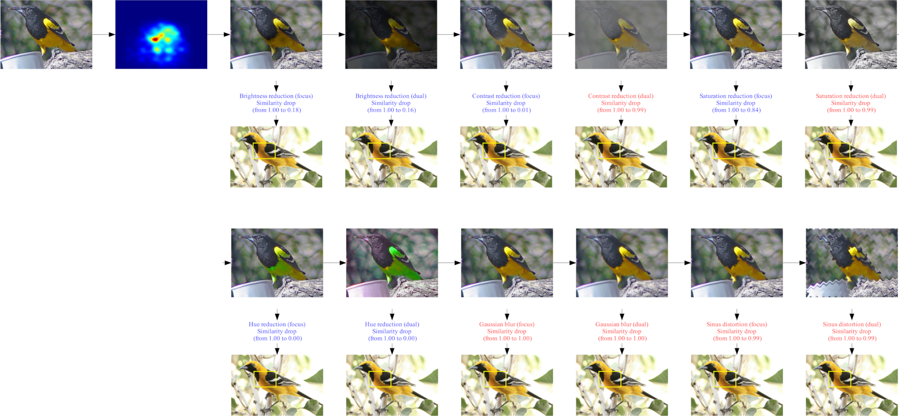
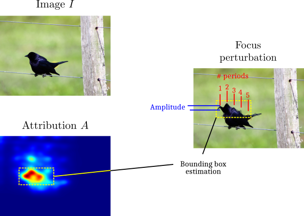

# Evaluating models
To go beyond the evaluation of the accuracy of case-based reasoning models,
CaBRNet implements several metrics for evaluating the quality of prototypes.
Currently, CaBRNet supports metrics that are derived from the following works:

- Sensitivity of prototype similarity to geometric perturbations, as described in *M.Nauta, A.Jutte, J.C.Provoost, C.Seifert*, 
[This looks like that, because ... explaining prototypes for interpretable image recognition](https://link.springer.com/chapter/10.1007/978-3-030-93736-2_34), 
PKDD/ECML Workshops, 2020.
- Relevance of prototypes, as described in *R.Xu-Darme, G.Quénot, Z.Chihani, M.-C.Rousset*, 
[Sanity checks for patch visualisation in prototype-based image classification](https://ieeexplore.ieee.org/document/10208853), XAI4CV at CVPR (2023).

## Metrics

### Evaluating the relevance of a patch of image using the pointing game

#### Description

This metric is inspired by the work of *R.Xu-Darme, G.Quénot, Z.Chihani, M.-C.Rousset*, 
[Sanity checks for patch visualisation in prototype-based image classification](https://ieeexplore.ieee.org/document/10208853), XAI4CV at CVPR (2023).

One key element contributing to the interpretability of a case-based reasoning
model resides in its ability to **correctly locate relevant parts of images where
a visual similarity has been established**, which depends on the choice of 
[attribution function](visualize.md) (as shown in R.Xu-Darme *et al*, 2023). 

Secondly, in the context of image classification, it can be argued that the decision
of the model should be based on the parts of the object itself inside the image rather than 
elements of the background (a cow remains a cow regardless of its environment, be it [a
field of grass or a sandy beach](https://arxiv.org/pdf/1907.02893.pdf)).

Thus, the purpose of the pointing game is to check that:

- Prototypes correspond to parts of the object inside images of the projection set
- When classifying a test image, the model establishes similarities between prototypes and 
parts of the object inside the test image.

In other words, this test evaluates the **relevance** of the patches of images used to compute the decision.
In practice, this test requires knowledge of the object segmentation $S$, which is sometimes provided
in the training dataset (*e.g.* [CUB200](https://www.vision.caltech.edu/datasets/cub_200_2011/)).
As shown below, from the attribution map $A$ and the segmentation $S$, the objective is to compute the
ratio of attribution that falls inside the object segmentation *w.r.t.* to the total attribution.



More precisely, this ratio is computed in two manners:

1) Either by summing the attribution score of all pixels inside the object segmentation and dividing by
the sum of all attribution scores, as in [Wang *et al*](https://arxiv.org/abs/1910.01279). 
The corresponding score is called the *energy relevance* score of the patch of image.
2) Or by first selecting only the most relevant pixels (according to a set percentage, *e.g.* 10% in the 
example below), then computing the ratio of these pixels inside the object segmentation, 
as in [Xu-Darme *et al.*](https://ieeexplore.ieee.org/document/10208853). 
The corresponding score is called the *mask relevance* score of the patch of image 
(since some pixels are masked out of the computation).




#### Reports

- prototype_info_db: A file containing, for each prototype $P$:

  - The index of the corresponding image $I$ inside the projection set
  - The energy and mask relevance scores of the prototype

- patch_info_db: A file containing, for each test image $I$ and its most similar prototype $P$,
the energy and mask relevance scores of the patch of $I$ most similar to $P$.

Note that these scores depend on the choice of [attribution function](visualize.md). 

#### Configuration
The benchmark is configured in a YML format as follows:

```yaml
relevance_analysis:
  prototype_info_db: <path_to_file> # Path to CSV file containing raw analysis per prototype
  patch_info_db: <path_to_file> # Path to CSV file containing raw analysis per test image
  area_percentage: <val> # Percentage of image area to keep when using a threshold during the pointing game
  debug_mode: <True|False> # If True, saves debug images
  sampling_ratio: <val> # Sampling ratio: only 1 in X images is analyzed
  num_prototypes: <val> # Maximum number of relevant prototypes to analyze per test image
```


### Understanding the nature of similarity through local perturbation analysis

#### Description

This metric is inspired by the work of *M.Nauta, A.Jutte, J.C.Provoost, C.Seifert*, 
[This looks like that, because ... explaining prototypes for interpretable image recognition](https://link.springer.com/chapter/10.1007/978-3-030-93736-2_34), 
PKDD/ECML Workshops, 2020. 

To provide understanding on the *nature* of the similarity between a prototype and a patch of
test image, the authors propose to apply geometric perturbations to the test image and to monitor a possible
drop in the similarity score between this image and the prototype. 
For instance, if the similarity between the test image and the prototype drops after applying a color shift
on the test image, then the similarity is likely based on color.
Importantly, if no perturbation leads to a drop in similarity, then the nature
of the similarity is unknown (i.e. based on abstract properties), **which questions the interpretability of the model**. 
Note that perturbations are applied on the entire test image, regardless of the location of the most similar patch identified by the 
attribution function (for more information on attribution methods see [here](visualize.md)).

CaBRNet implements a similar measure of a drop in similarity. 
However, **it uses the attribution map to apply local (rather than global) perturbations**. 
The intuition is that, assuming that the attribution method in use is indeed able to identify the most relevant pixels in the test
image w.r.t. the similarity score with a given prototype, then:

1) A local perturbation of these pixels should be sufficient to elicit a drop in similarity (assuming
that the nature of the similarity is indeed tied to this type of perturbation).
2) A perturbation of **all other pixels** (i.e. the least important pixels) should **not** lead to a drop in similarity.

Currently, CaBRNet supports the following types of perturbations:

- Brightness reduction
- Contrast reduction
- Saturation reduction
- Hue shift
- Gaussian blur
- Sinus distortion

In practice, for each image $I$ in a given test dataset, CaBRNet first identifies the
most similar prototype $P$. Then, it creates two images corresponding to a focused and dual perturbation
respectively, using:

- The original image $I$
- The perturbed image $\tilde{I}$, as in Nauta *et al*, 2020
- The attribution map $A$ (normalized between 0 and 1) returned by the chosen attribution method and
corresponding to the pixels in image $I$ most similar to prototype $P$



Then for each type of perturbation and each pair of images (focused and dual),
CaBRNet measures the drop in similarity score, as shown below:



Importantly, by applying this local (focused) perturbation based on the attribution map,
CaBRNet conditions the interpretability of a case-based reasoning model to:

- Its ability to correctly locate the pixels in the test image that are most similar to a given prototype.
- The existence of *at least* one perturbation leading a drop in similarity, which informs the user on the nature of
that similarity

#### Reports

- info_db: A file containing, for each test image $I$ and its most similar prototype $P$,
and for each type of perturbation:

  - The original similarity score between $I$ and $P$
  - The name of the perturbation
  - The similarity score of the focused perturbed image
  - The similarity score of the dual perturbed image

- global stats:
  
  - The number of covered prototypes (not all may be covered, since a prototype may never be the most similar to any of the test images)
  - The average percentage of similarity drop per type of perturbation when applying focused perturbations.  

#### Configuration
The benchmark is configured in a YML format as follows:
```yaml
local_perturbation_analysis:
  info_db: <path_to_file> # Path to CSV file containing raw analysis per test image
  global_stats: <path_to_file> # Path to CSV file containing general global stats
  sampling_ratio: <X> # Sampling ratio: only 1 in X images is analyzed
  num_prototypes: <val> # Maximum number of relevant prototypes to analyze per test image
  enable_dual_mode: <True|False> # If True, compute sensitivity test on dual perturbation
  distribution_img: <path_to_image> # Path to output image showing distribution of max similarity drops
  quiet: <True|False> # If True, does not show the distribution image
  debug_mode: <True|False> # If True, saves perturbations (used for debugging purposes)
  # Perturbation parameters
  brightness_factor: <val> # A value of 0.3 means brightness is (locally) reduced by 70% 
  contrast_factor: <val> # A value of 0.3 means contrast is (locally) reduced by 70%
  saturation_factor: <val> # A value of 0.3 means saturation is (locally) reduced by 70%
  hue_factor: <val> # A value of 0.2 means a (local) shift of 20% on the hue scale
  gaussian_noise_ksize: <val> # Size of the kernel to apply gaussian noise  
  gaussian_noise_sigma: <val> # Standard deviation of the gaussian noise
  distortion_periods: <val> # Controls the frequency of the (local) sinus distortion 
  distortion_amplitude: <val> # Controls the amplitude of the (local) sinus distortion
```

Note on the sinus distortion: to adapt the intensity of the sinus distortion
to the relative size of the patch inside the image, CaBRNet uses the attribution map $A$
to:

1) Estimate a bounding box encompassing the most relevant pixels
2) Compute the *frequency* of the distortion based on the requested number of periods (5 in the example below)
and the width of the bounding box.



## Launching the benchmark

Case-based reasoning models are evaluated on these metrics using the [benchmark](cabrnet.md#evaluating-a-cabrnet-model) 
application. For simplicity, CaBRNet uses a single YML file containing the configuration of each metric 
(see example provided [here](https://github.com/aiser-team/cabrnet/blob/develop/configs/benchmarks/test_configuration.yml).


