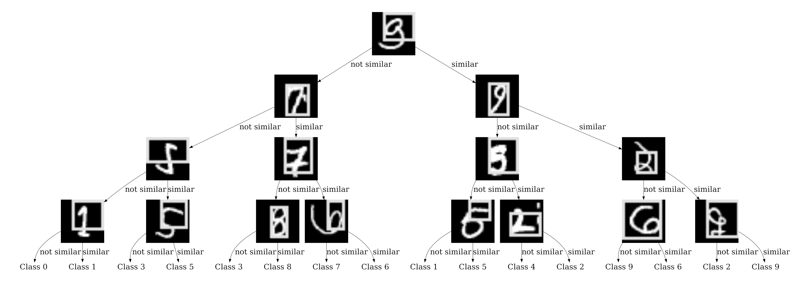
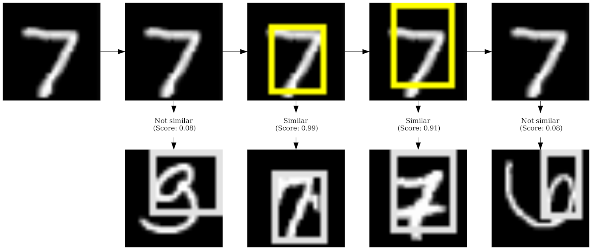
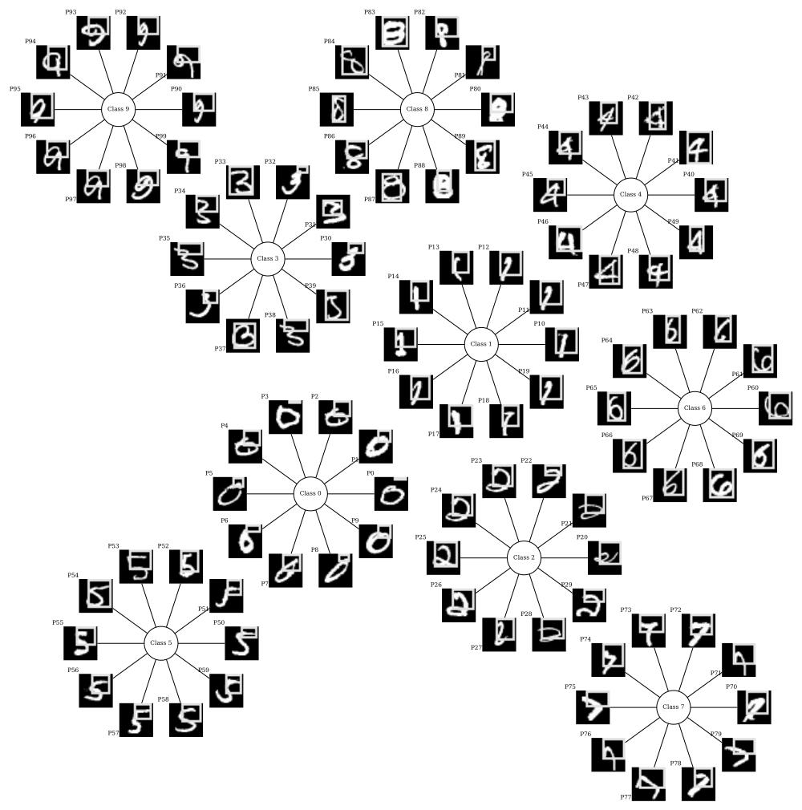
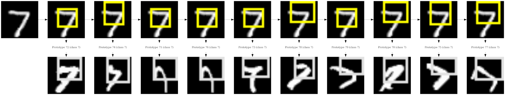

# Example on MNIST
## Using ProtoTree
### Training
```bash
cd ../../ # Go back to root directory
cabrnet train --device cpu --seed 42 --verbose --logger-level INFO  \
  --model-arch configs/prototree/mnist/model_arch.yml \
  --dataset configs/prototree/mnist/dataset.yml \
  --training configs/prototree/mnist/training.yml \
  --output-dir runs/mnist_prototree \
  --logger-file runs/mnist_prototree/log.txt
```
or simply
```bash
cd ../../ # Go back to root directory
cabrnet train --device cpu --seed 42 --verbose --logger-level INFO  \
  -c configs/prototree/mnist/ \
  --output-dir runs/mnist_prototree \
  --logger-file runs/mnist_prototree/log.txt
```
These commands train a ProtoTree during one epoch, and store the resulting checkpoint in 
`runs/mnist_prototree/final`.

### Global explanation
```bash
cd ../../ # Go back to root directory
cabrnet explain_global --verbose \
  --model-arch runs/mnist_prototree/final/model_arch.yml \
  --model-state-dict runs/mnist_prototree/final/model_state.pth \
  --dataset runs/mnist_prototree/final/dataset.yml \
  --projection-info runs/mnist_prototree/final/projection_info.csv \
  --visualization configs/explanation/mnist_visualization.yml \
  --output-dir runs/mnist_prototree/global_explanation 
```
or simply
```bash
cd ../../ # Go back to root directory
cabrnet explain_global --verbose \
  --checkpoint-dir runs/mnist_prototree/final \
  --visualization configs/explanation/mnist_visualization.yml \
  --output-dir runs/mnist_prototree/global_explanation 
```
These commands generate a global explanation for the ProtoTree model in 
`runs/mnist_prototree/global_explanation`. 
In particular, the visualization of each prototype is stored in 
`runs/mnist_prototree/global_explanation/prototypes`.



### Local explanation
```bash
cd ../../ # Go back to root directory
cabrnet explain_local --verbose \
  --model-arch runs/mnist_prototree/final/model_arch.yml  \
  --model-state-dict runs/mnist_prototree/final/model_state.pth \
  --dataset runs/mnist_prototree/final/dataset.yml \
  --visualization configs/explanation/mnist_visualization.yml \
  --prototype-dir runs/mnist_prototree/global_explanation/prototypes \
  --output-dir runs/mnist_prototree/local_explanations/  \
  --image examples/images/mnist_sample.png
```
or simply
```bash
cd ../../ # Go back to root directory
cabrnet explain_local --verbose \
  -c runs/mnist_prototree/final  \
  --visualization configs/explanation/mnist_visualization.yml \
  --prototype-dir runs/mnist_prototree/global_explanation/prototypes \
  --output-dir runs/mnist_prototree/local_explanations/  \
  --image examples/images/mnist_sample.png
```
These commands generate a local explanation for the image stored in `examples/images/mnist_sample.png` and store the result in 
`runs/mnist_prototree/local_explanation`. 
In particular, producing local explanations requires 
prototype visualizations, which can be generated using the `cabrnet explain_global` application described above.



## Using ProtoPNet
### Training
```bash
cd ../../ # Go back to root directory
cabrnet train --device cpu --seed 42 --verbose --logger-level INFO  \
  --model-arch configs/protopnet/mnist/model_arch.yml \
  --dataset configs/protopnet/mnist/dataset.yml \
  --training configs/protopnet/mnist/training.yml \
  --output-dir runs/mnist_protopnet \
  --logger-file runs/mnist_protopnet/log.txt
```
or simply
```bash
cd ../../ # Go back to root directory
cabrnet train --device cpu --seed 42 --verbose --logger-level INFO  \
  -c configs/protopnet/mnist/ \
  --output-dir runs/mnist_protopnet \
  --logger-file runs/mnist_protopnet/log.txt
```
These commands train a ProtoPNet during one epoch, and store the resulting checkpoint in 
`runs/mnist_protopnet/final`.

### Global explanation
```bash
cd ../../ # Go back to root directory
cabrnet explain_global --verbose \
  --model-arch runs/mnist_protopnet/final/model_arch.yml \
  --model-state-dict runs/mnist_protopnet/final/model_state.pth \
  --dataset runs/mnist_protopnet/final/dataset.yml \
  --projection-info runs/mnist_protopnet/final/projection_info.csv \
  --visualization configs/explanation/mnist_visualization.yml \
  --output-dir runs/mnist_protopnet/global_explanation 
```
or simply
```bash
cd ../../ # Go back to root directory
cabrnet explain_global --verbose \
  --checkpoint-dir runs/mnist_protopnet/final \
  --visualization configs/explanation/mnist_visualization.yml \
  --output-dir runs/mnist_protopnet/global_explanation
``` 
These commands generate a global explanation for the ProtoPNet model in 
`runs/mnist_protopnet/global_explanation`.
In particular, the visualization of each prototype is stored in 
`runs/mnist_protopnet/global_explanation/prototypes`.



### Local explanation
```bash
cd ../../ # Go back to root directory
cabrnet explain_local --verbose \
  --model-arch runs/mnist_protopnet/final/model_arch.yml  \
  --model-state-dict runs/mnist_protopnet/final/model_state.pth \
  --dataset runs/mnist_protopnet/final/dataset.yml \
  --visualization configs/explanation/mnist_visualization.yml \
  --prototype-dir runs/mnist_protopnet/global_explanation/prototypes/ \
  --output-dir runs/mnist_protopnet/local_explanations/  \
  --image examples/images/mnist_sample.png
```
or simply
```bash
cd ../../ # Go back to root directory
cabrnet explain_local --verbose \
  -c runs/mnist_protopnet/final/ \
  --visualization configs/explanation/mnist_visualization.yml \
  --prototype-dir runs/mnist_protopnet/global_explanation/prototypes/ \
  --output-dir runs/mnist_protopnet/local_explanations/  \
  --image examples/images/mnist_sample.png
```

This command generates a local explanation for the image `examples/images/mnist_sample.png` and stores the result in 
`runs/mnist_protopnet/local_explanation`.
In particular, producing local explanations requires 
prototype visualizations, which can be generated using the `cabrnet explain_global` application described above.




## Hyperparameter tuning
As described [here](cabrnet.md#hyperparameter-tuning-using-bayesian-optimization), it is possible to 
explore multiple hyperparameter values using Bayesian optimization. For this example, 
we study the hyperparameters of a ProtoPNet applied on MNIST. To speed-up computation, we use
the `--sanity-check` options, which reduces the size of the training by a factor 100.

```bash
cd ../../ # Go back to root directory
export RAY_CHDIR_TO_TRIAL_DIR=0 # Required to control Ray-Tune working directory
cabrnet bayesian_optimizer --device cuda:0  --verbose \
  --config-dir configs/protopnet/mnist_with_bayesian_optimization/ \
  --output-dir runs/mnist_protopnet_bayesian_opt \
  --save-best loss min  \
  --search-space accuracy max configs/protopnet/mnist_with_bayesian_optimization/search_space.yml 10 \
  --patience 5 --sanity-check 
```
