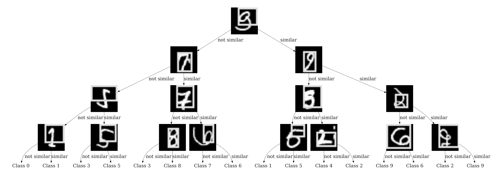
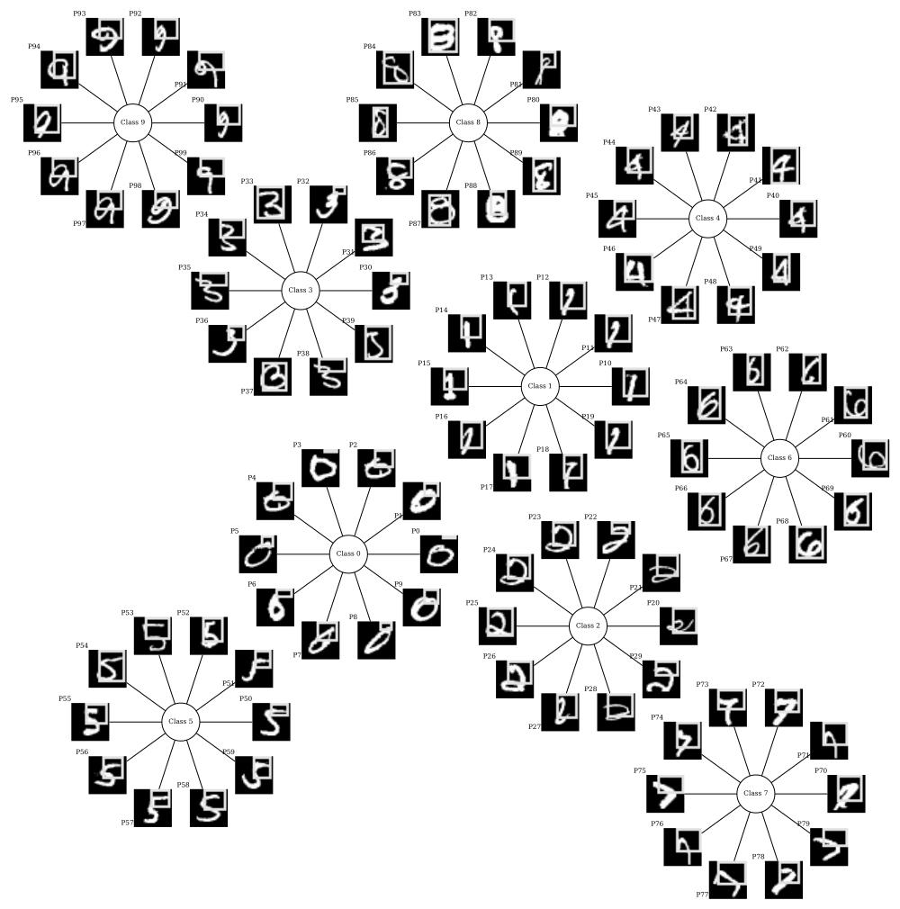
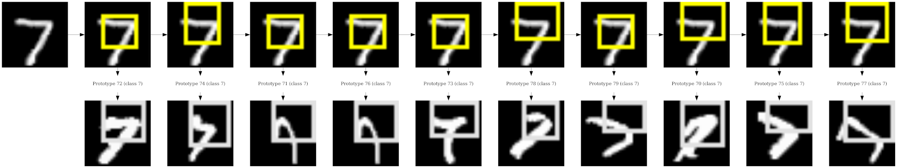

# Example on MNIST
## Using ProtoTree
### Training
```bash
cabrnet train --device cpu --seed 42 --verbose --logger-level INFO  \
  --model-config configs/prototree/mnist/model_arch.yml \
  --dataset configs/prototree/mnist/dataset.yml \
  --training configs/prototree/mnist/training.yml \
  --output-dir runs/mnist_prototree \
  --visualization configs/prototree/mnist/visualization.yml
```
This command trains a ProtoTree during one epoch, and stores the resulting checkpoint in 
`runs/mnist_prototree/final`.

### Global explanation
```bash
cabrnet explain_global --verbose \
  --model-config runs/mnist_prototree/final/model_arch.yml \
  --model-state-dict runs/mnist_prototree/final/model_state.pth \
  --output-dir runs/mnist_prototree/global_explanation --prototype-dir runs/mnist_prototree/prototypes/
```
This command generates a global explanation for the ProtoTree model in 
`runs/mnist_prototree/global_explanation`.



### Local explanation
```bash
cabrnet explain_local --verbose \
  --model-config runs/mnist_prototree/final/model_arch.yml  \
  --model-state-dict runs/mnist_prototree/final/model_state.pth \
  --dataset configs/prototree/mnist/dataset.yml \
  --visualization configs/prototree/mnist/visualization.yml \
  --prototype-dir runs/mnist_prototree/prototypes/ \
  --output-dir runs/mnist_prototree/local_explanations/  \
  --image examples/images/mnist_sample.png
```
This command generates a local explanation for the image stored in `examples/images/mnist_sample.png` and stores the result in 
`runs/mnist_prototree/local_explanation`.


## Using ProtoPNet
### Training
```bash
cabrnet train --device cpu --seed 42 --verbose --logger-level INFO  \
  --model-config configs/protopnet/mnist/model_arch.yml \
  --dataset configs/protopnet/mnist/dataset.yml \
  --training configs/protopnet/mnist/training.yml \
  --output-dir runs/mnist_protopnet \
  --visualization configs/protopnet/mnist/visualization.yml
```
This command trains a ProtoPNet during one epoch, and stores the resulting checkpoint in 
`runs/mnist_protopnet/final`.

### Global explanation
```bash
cabrnet explain_global --verbose \
  --model-config runs/mnist_protopnet/final/model_arch.yml \
  --model-state-dict runs/mnist_protopnet/final/model_state.pth \
  --output-dir runs/mnist_protopnet/global_explanation --prototype-dir runs/mnist_protopnet/prototypes/
```
This command generates a global explanation for the ProtoPNet model in 
`runs/mnist_protopnet/global_explanation`.



### Local explanation
```bash
cabrnet explain_local --verbose \
  --model-config runs/mnist_protopnet/final/model_arch.yml  \
  --model-state-dict runs/mnist_protopnet/final/model_state.pth \
  --dataset configs/protopnet/mnist/dataset.yml \
  --visualization configs/protopnet/mnist/visualization.yml \
  --prototype-dir runs/mnist_protopnet/prototypes/ \
  --output-dir runs/mnist_protopnet/local_explanations/  \
  --image examples/images/mnist_sample.png
```
This command generates a local explanation for the image `examples/images/mnist_sample.png` and stores the result in 
`runs/mnist_protopnet/local_explanation`.



