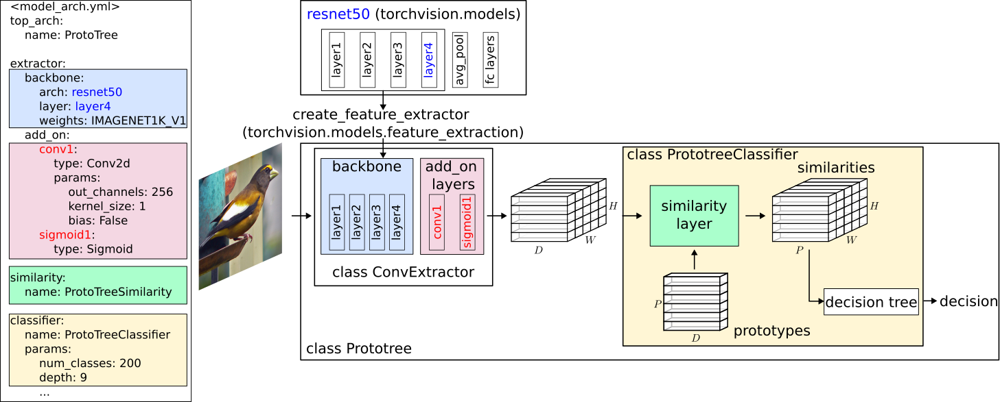
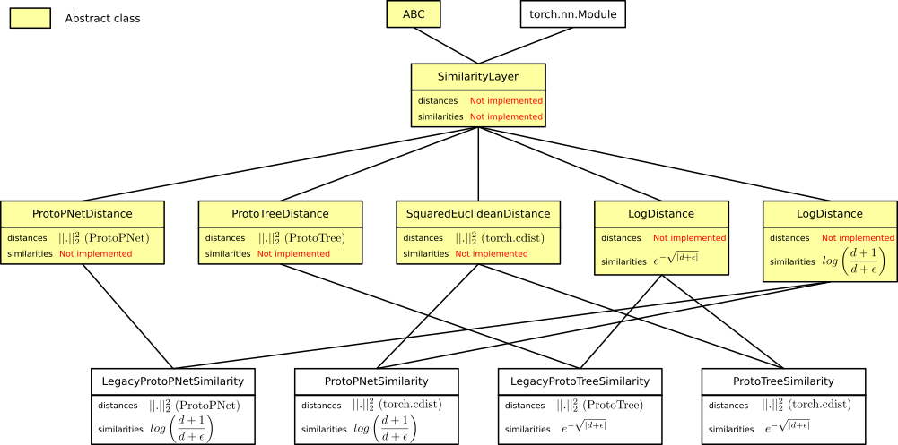

# Model configuration
The specification of a CaBRNet model architecture is stored in a YML file, according to the following specification.
For more examples, see the [ProtoPNet](https://github.com/aiser-team/cabrnet/tree/main/configs/protopnet/cub200/model_arch.yml) and 
[ProtoTree](https://github.com/aiser-team/cabrnet/tree/main/configs/prototree/cub200/model_arch.yml) configuration files.

As shown below, each CaBRNet model is composed of:

- a [feature extractor](#extractor-configuration) that processes the input image and produces a set of features, 
usually in the form of a 3-dimensional tensor (D, H, W) where:
    - D is the number of (convolutional) channels.
    - H x W represent the size of the image representation after downsampling. In other words, for each image,
the feature extractor produce a HxW map of D-dimensional vectors, called the **feature map**.
- a [similarity layer](#similarity-configuration) that computes similarity scores between each vector of the feature map and each prototype, using a similarity layer 
    (*e.g.* based on the L2 distance between vectors in $\mathbb{R}^D$). 
- a [classifier](#classifier-configuration) that:
    - implements a set of prototypes that are either specific to a given class, or shared among multiples classes. 
    - embeds the similarity layer to compute scores.
    - computes the classification logits based on these scores (*e.g.* using a Decision Tree in ProtoTree).




As illustrated for [ProtoTree](https://github.com/aiser-team/cabrnet/tree/main/src/cabrnet/prototree) or [ProtoPNet](https://github.com/aiser-team/cabrnet/tree/main/src/cabrnet/protopnet), the code for each
type of architecture is regrouped into a dedicated directory and contains:

- a file `decision.py` describing the module in charge of performing the prototype-based classification
- a file `model.py` describing the top-level architecture (combination of the feature extractor and the classifier).

Instructions on how to define a new architecture can be found [here](#implementing-a-new-prototype-based-architecture).

## Extractor configuration
The feature extractor is configured through a dedicated section of the configuration file, 
using the `extractor` keyword. A feature extractor is based on a pre-existing CNN classifier architecture - identified by the `backbone` keyword - where the last layers (in charge of the classification itself) have been removed. 

Additionally, in order to reduce the number of dimensions, it is possible to add a set of additional 
layers using the `add_on` keyword.


### Single layer extraction
This is the default (and most used) mode for feature extraction, where we extract the result of a 
single layer `<LAYER_NAME>` as follows:
```yaml
extractor:
  backbone:
    arch: <FEATURE_EXTRACTOR_ARCH> # Must belong to torchvision.models.list_models()
    weights: <null | path/to/state/dict.pth | WEIGHTS_NAME>
    layer: <LAYER_NAME> # Remove all layers in backbone after this one 
    params: # Optional parameters of the model init function
      <PARAM_NAME_1>: <VALUE>

  add_on: # Optional
    init_mode: <XAVIER | PROTOPNET> # Optional: Parameter initialization procedure
    <LAYER_NAME_1>:
      type: <FUNCTION_NAME> # Layer name, as given in torch.nn
      params: # Optional
        <PARAM_NAME_1>: <VALUE>
        <PARAM_NAME_2>: <VALUE>
    <LAYER_NAME_2>:

similarity:
  ...

classifier:
  ...
```
Notes on the configuration of the backbone:

- `arch`: Currently, CaBRNet only supports backbone architectures that belong to the list given by 
[torchvision.models.list_models()](https://pytorch.org/vision/main/generated/torchvision.models.list_models.html).
- `weights`: The backbone parameters can be either initialized:
    - randomly (`null` keyword).
    - by providing the path to an existing state dictionary or trained model.
    - by providing the name of a valid set of pre-trained parameters, as given by 
[torchvision.models.get_model_weights(arch)](https://pytorch.org/vision/main/generated/torchvision.models.get_model_weights.html) (*e.g.* `IMAGENET1K_V1` for ImageNet pre-trained weights).
- `layer`: Since the backbone model is usually a classifier, CaBRNet uses the 
[create_feature_extractor](https://pytorch.org/vision/main/generated/torchvision.models.feature_extraction.create_feature_extractor.html) 
function to automatically remove its deepest layers and to keep only the convolutional layers.
- `params`: Additional parameters can be provided to the constructor of the backbone model, such as the
number of classes of the underlying classifier, *e.g.* when initializing a backbone from a pretrained classifier
fine-tuned on a particular task. For example, when using a Resnet50 classifier pretrained on CUB200, the backbone 
configuration may look like this:

```yaml
extractor:
  backbone:
    arch: resnet50
    layer: layer4
    weights: examples/pretrained_conv_extractors/r50_CUB200.pth # Path to a pretrained model
    params:
      num_classes: 200 # How to initialize the ResNet50 BEFORE the state dictionary is loaded
...
```

Add-on layers can be added after the backbone in order to reduce the dimensionality of the learned prototypes, 
using the `add_on` keyword. In this case, each layer is identified by a layer name and configured using:

- `type`: Supported layer types can be found in [torch.nn](https://pytorch.org/docs/stable/nn.html).
- `params`: An optional field that contains the information necessary to build the layer.

CaBRNet also supports the (optional) use of special function for the initialization of the add-on layers, 
through the `init_mode` keyword:

- `XAVIER`: used in ProtoTree and based on [nn.init.xavier_normal_](https://pytorch.org/cppdocs/api/function_namespacetorch_1_1nn_1_1init_1a86191a828a085e1c720dbce185d6c307.html)
- `PROTOPNET`: a combination of [nn.init.kaiming_normal_](https://pytorch.org/cppdocs/api/function_namespacetorch_1_1nn_1_1init_1ac8a913c051976a3f41f20df7d6126e57.html) 
for convolutional layers and a static starting configuration for BatchNorm layers. 

### Multi-layer extraction
To extract features from multiple layers simultaneously, CaBRNet proposes an alternate way to describe
feature extraction which removes the `layer` keyword inside the backbone configuration in favor of a
more generic approach that focuses on several **pipelines**. In practice, a pipeline is defined by a 
source layer inside the backbone, followed by an optional set of add-on layers.

```yaml
extractor:
  backbone:
    arch: <FEATURE_EXTRACTOR_ARCH> # Must belong to torchvision.models.list_models()
    weights: <null | path/to/state/dict.pth | WEIGHTS_NAME>
    params: # Optional parameters of the model init function
      <PARAM_NAME_1>: <VALUE>

  <PIPELINE_NAME_1>: # Name of the pipeline
    source_layer: <LAYER_1> # Name of the source layer inside the model
    add_on: # Optional
      init_mode: <XAVIER | PROTOPNET> # Optional: Parameter initialization procedure
      <LAYER_NAME_1>:
        type: <FUNCTION_NAME> # Layer name, as given in torch.nn
        params: # Optional
          <PARAM_NAME_1>: <VALUE>
          <PARAM_NAME_2>: <VALUE>
      <LAYER_NAME_2>:
  
  <PIPELINE_NAME_2>:
    source_layer: <LAYER_2> # Name of the source layer inside the model
    add_on: # Optional
      init_mode: <XAVIER | PROTOPNET> # Optional: Parameter initialization procedure
      <LAYER_NAME_1>:
        type: <FUNCTION_NAME> # Layer name, as given in torch.nn
        params: # Optional
          <PARAM_NAME_1>: <VALUE>
          <PARAM_NAME_2>: <VALUE>
      <LAYER_NAME_2>:
  

similarity:
  ...

classifier:
  ...
```

For instance, 
```yaml
extractor:  
  backbone:
    arch: resnet50
    layer: layer4
    weights: IMAGENET1K_V1
  add_on:
    init_mode: XAVIER
    conv1:
      type: Conv2d # nn.Module name
      params:
        out_channels: 128
        kernel_size: 1
        bias: False
    sigmoid1:
      type: Sigmoid
```
is equivalent to 
```yaml
extractor:  
  backbone:
    arch: resnet50
    weights: IMAGENET1K_V1
  convnet: # Name of the default pipeline
    source_layer: layer4
    add_on:
      init_mode: XAVIER
      conv1:
        type: Conv2d # nn.Module name
        params:
          out_channels: 128
          kernel_size: 1
          bias: False
      sigmoid1:
        type: Sigmoid
```

## Similarity configuration
The similarity layer computes similarity scores and distances in the feature space.
Although the choice of a similarity function is usually specific to each type of model 
architecture, CaBRNet offers a generic approach for using any similarity function with any architecture.
```yaml
similarity: 
  module: <MODULE_NAME> # Optional. By default: cabrnet.utils.similarities
  name: <CLASS_NAME>
  params: # Optional
    <PARAM_1>: <VALUE>
    <PARAM_2>: <VALUE>
...
```
Currently, CaBRNet supports the following similarity layers:
- `LegacyProtoPNetSimilarity`: implements all operations performed in the original ProtoPNet code, in the same order.
- `LegacyProtoTreeSimilarity`: implements all operations performed in the original ProtoTree code, in the same order.
- `ProtoPNetSimilarity`: updated version of LegacyProtoPNetSimilarity that uses the [`torch.cdist`](https://pytorch.org/docs/stable/generated/torch.cdist.html) function.
- `ProtoTreeSimilarity`: updated version of LegacyProtoTreeSimilarity that uses the [`torch.cdist`](https://pytorch.org/docs/stable/generated/torch.cdist.html) function.

To implement a new similarity layer, see [here](#defining-a-new-similarity-layer).

## Classifier configuration
The classifier performs the classification based on similarities between the output of the feature extractor and a set
of **prototypes**. Prototype management is specific to each type of model architecture (*e.g.* decision tree in ProtoTree, 
linear layer in ProtoPNet).
```yaml
classifier: 
  module: <MODULE_NAME>
  name: <CLASS_NAME>
  params:
    num_features: 256 # Optional
    <PARAM_2>: <VALUE>
...
```
Note that the parameter `num_features` is optional, as it can be recovered from the output of 
the feature extractor.

## Top-level configuration
The top-level model, that combines the feature extractor and the classifier, is configured as follows:
```yaml
top_arch:
  module: <MODULE>
  name: <CLASS_NAME>
```

# Implementing a new prototype-based architecture

## Defining a new similarity layer
CaBRNet implements an abstract interface, called `SimilarityLayer`:
```python
from abc import ABC, abstractmethod
import torch.nn as nn
from torch import Tensor


class SimilarityLayer(nn.Module, ABC):
    r"""Abstract layer for computing similarity scores based on distances in the convolutional space."""

    def __init__(self, **kwargs):
        r"""Uses nn.Module init function."""
        nn.Module.__init__(self)

    @abstractmethod
    def distances(self, features: Tensor, prototypes: Tensor, **kwargs) -> Tensor:
        r"""Computes pairwise distances between a tensor of features and a tensor of prototypes.

        Args:
            features (tensor): Input tensor. Shape (N, D, H, W).
            prototypes (tensor): Tensor of prototypes. Shape (P, D, 1, 1).

        Returns:
             Distance between each feature vector and each prototype. Shape (N, P, H, W).
        """
        raise NotImplementedError

    @abstractmethod
    def similarities(self, features: Tensor, prototypes: Tensor, **kwargs) -> Tensor:
        r"""Computes pairwise similarity scores between a tensor of features and a tensor of prototypes.

        Args:
            features (tensor): Input tensor. Shape (N, D, H, W).
            prototypes (tensor): Tensor of prototypes. Shape (P, D, 1, 1).

        Returns:
            Tensor of similarity scores. Shape (N, P, H, W).
        """
        raise NotImplementedError

    def forward(self, features: Tensor, prototypes: Tensor, **kwargs) -> Tensor:
        r"""Return pairwise similarity scores between a tensor of features and a tensor of prototypes.

        Args:
            features (tensor): Input tensor. Shape (N, D, H, W).
            prototypes (tensor): Tensor of prototypes. Shape (P, D, 1, 1).

        Returns:
            Tensor of similarity scores. Shape (N, P, H, W).
            Tensor of distances. Shape (N, P, H, W).
        """
        return self.similarities(features, prototypes, **kwargs)

```
This interface provides a generic way to define:
- how to compute distances between the feature vectors and the prototypes.
- how to convert a distance into a similarity score.

In practice, CaBRNet uses intermediate abstract classes that provide the building blocks for
similarity layers, as shown below:



The new similarity layer can be added to the `src/cabrnet/utils/similarities.py` file.

## Defining a new classifier architecture
The module in charge of classification should be placed inside a dedicated file in
`src/cabrnet/<ARCH_NAME>/decision.py` (*e.g.* [src/cabrnet/prototree/decision.py](https://github.com/aiser-team/cabrnet/tree/main/src/cabrnet/prototree/decision.py)).

The following code provides a minimal example on how to define a new classifier.
The classifier must inherit from the `CaBRNetGenericClassifier` class as follows:
```python
import torch.nn as nn
from typing import Any
from cabrnet.utils.prototypes import init_prototypes
from cabrnet.generic.decision import CaBRNetClassifier


class ArchNameClassifier(CaBRNetClassifier):
    r"""Classification pipeline for ArchName architecture."""

    def __init__(
        self,
        similarity_config: dict[str, Any],
        num_classes: int,
        num_features: int,
        proto_init_mode: str = "SHIFTED_NORMAL",
    ) -> None:
        r"""Initializes a ArchName classifier.

        Args:
            similarity_config (dict): Configuration of the layer used to compute similarity scores between the
                prototypes and the convolutional features.
            num_features (int): Number of features (size of each prototype).
            num_classes (int): Number of classes.
            proto_init_mode (str, optional): Init mode for prototypes. Default: Shifted normal distribution.
            ...
        """
        super().__init__(
            num_classes=num_classes,
            num_features=num_features,
            proto_init_mode=proto_init_mode,
        )

        # Init prototypes
        self.prototypes = nn.Parameter(
            init_prototypes(
                num_prototypes=self.num_prototypes,
                num_features=self.num_features,
                init_mode=proto_init_mode,
            )
        )

        # Init self.similarity_layer using CaBRNetClassifier.build_similarity
        self.build_similarity(similarity_config)
        ...

    def prototype_is_active(self, proto_idx: int) -> bool:
        r"""Is the prototype *proto_idx* active or disabled?
        Args:
            proto_idx (int): Prototype index.
        """
        ...

    def forward(self, features: Any, **kwargs) -> ...:
        r"""Performs classification.

        Args:
            features: Convolutional features from extractor.
                Either a single tensor of shape (N, D, H, W) or
                a dictionary of tensors in the case of multi-layer extraction.

        Returns:
            Vector of logits.
        """
        similarities = self.similarity_layer(features, self.prototypes)

        # Compute classification based on similarity scores
        ...

```

## Defining a new top-module
The module in charge of combining the feature extractor and the classifier should be
placed inside a dedicated file in `src/cabrnet/<ARCH_NAME>/model.py` (*e.g.* [src/cabrnet/prototree/model.py](https://github.com/aiser-team/cabrnet/blob/main/src/cabrnet/prototree/model.py)).
The top-module class should inherit from the generic class [CaBRNet](https://github.com/aiser-team/cabrnet/blob/main/src/cabrnet/generic/model.py), and implements
some mandatory functions as illustrated below.
```python
import torch.nn.functional
from torch.utils.data import DataLoader
from typing import Any, Callable
from tqdm import tqdm
from PIL import Image
from cabrnet.generic.model import CaBRNet
from cabrnet.utils.optimizers import OptimizerManager
from cabrnet.visualization.visualizer import SimilarityVisualizer


class ArchName(CaBRNet):
    def loss(
        self, model_output: Any, label: torch.Tensor
    ) -> tuple[torch.Tensor, dict[str, float]]:
        r"""Loss function.

        Args:
            model_output (Any): Model output.
            label (tensor): Batch labels.

        Returns:
            Loss tensor and batch statistics.
        """
        loss = ...
        batch_stats = {"accuracy": ..., "loss": ...}
        return loss, batch_stats

    def train_epoch(  # Mandatory signature
        self,
        dataloaders: dict[str, DataLoader],
        optimizer_mngr: OptimizerManager,
        device: str | torch.device = "cuda:0",
        tqdm_position: int = 0,
        epoch_idx: int = 0,
        verbose: bool = False,
        max_batches: int | None = None,
    ) -> dict[str, float]:
        r"""Trains the model for one epoch.

        Args:
            dataloaders (dictionary): Dictionary of dataloaders.
            optimizer_mngr (OptimizerManager): Optimizer manager.
            device (str | device, optional): Hardware device. Default: cuda:0.
            tqdm_position (int, optional): Position of the progress bar. Default: 0.
            epoch_idx (int, optional): Epoch index. Default: 0.
            verbose (bool, optional): Display progress bar. Default: False.
            max_batches (int, optional): Max number of batches (early stop for small compatibility tests).
                Default: None.

        Returns:
            Dictionary containing learning statistics.
        """
        self.train()
        self.to(device)

        # Training stats
        total_loss = 0.0
        total_acc = 0.0
        
        # Recover dataloader on training data 
        train_loader = dataloaders["train_set"]

        # Show progress on progress bar if needed
        train_iter = tqdm(
            enumerate(train_loader),
            total=len(train_loader),
            leave=False,
            position=tqdm_position,
            disable=not verbose,
        )
        batch_num = len(train_loader)

        for batch_idx, (xs, ys) in train_iter:
            # Reset gradients and map the data on the target device
            optimizer_mngr.zero_grad()
            xs, ys = xs.to(device), ys.to(device)

            # Perform inference and compute loss
            ys_pred, info = self.forward(xs)
            batch_loss, batch_stats = self.loss((ys_pred, info), ys)

            # Compute the gradient and update parameters
            batch_loss.backward()
            optimizer_mngr.optimizer_step(epoch=epoch_idx)

            # Update global metrics
            batch_accuracy = batch_stats["accuracy"]
            total_loss += batch_loss.item()
            total_acc += batch_accuracy
            
            if max_batches is not None and batch_idx == max_batches:
                # Early stop for small tests and sanity checks
                break

        # Clean gradients after last batch
        optimizer_mngr.zero_grad()

        train_info = {"avg_loss": total_loss / batch_num, "avg_train_accuracy": total_acc / batch_num}
        return train_info

    def evaluate(
        self,
        dataloader: DataLoader,
        device: str | torch.device = "cuda:0",
        tqdm_position: int = 0,
        verbose: bool = False,
    ) -> dict[str, float]:
        r"""Evaluates the model.

        Args:
            dataloader (DataLoader): Dataloader containing evaluation data.
            device (str | device, optional): Hardware device. Default: cuda:0.
            tqdm_position (int, optional): Position of the progress bar. Default: 0.
            verbose (bool, optional): Display progress bar. Default: 0.

        Returns:
            Dictionary containing evaluation statistics.
        """
        # Already implemented in the generic CaBRNet class
        ...

    def project(
        self,
        dataloader: DataLoader,
        device: str | torch.device = "cuda:0",
        verbose: bool = False,
        tqdm_position: int = 0,
    ) -> dict[int, dict]:
        r"""Performs prototype projection after training.

        Args:
            dataloader (DataLoader): Dataloader containing projection data.
                WARNING: This dataloader must not be shuffled!
            device (str | device, optional): Hardware device. Default: cuda:0.
            verbose (bool, optional): Display progress bar. Default: False.
            tqdm_position (int, optional): Position of the progress bar. Default: 0.

        Returns:
            Dictionary containing projection information for each prototype.
        """
        # Number of prototypes
        num_prototypes = self.num_prototypes

        # For each prototype, keep track of:
        #   - the index of the closest projection image
        #   - the coordinates of the vector inside the latent representation of that image
        #   - the corresponding similarity score
        #   - the corresponding vector
        projection_info = {
            proto_idx: {
                "img_idx": -1,
                "h": -1,
                "w": -1,
                "score": 0,
            }
            for proto_idx in range(num_prototypes)
        }
        # Perform projection
        ...
        return projection_info

    def epilogue(
        self,
        dataloaders: dict[str, DataLoader],
        optimizer_mngr: OptimizerManager,
        output_dir: str,
        device: str | torch.device = "cuda:0",
        verbose: bool = False,
        **kwargs,
    ) -> None:
        r"""Function called after training, using information from the epilogue field in the training configuration.
            This usually contains prototype pruning, projection and extraction.

        Args:
            dataloaders (dictionary): Dictionary of dataloaders.
            optimizer_mngr (OptimizerManager): Optimizer manager.
            output_dir (str): Path to output directory.
            device (str | device, optional): Hardware device. Default: cuda:0.
            verbose (bool, optional): Display progress bar. Default: False.
        """
        ...

    def explain(
        self,
        img: str | Image.Image,
        preprocess: Callable,
        visualizer: SimilarityVisualizer | None,
        prototype_dir: str = "",
        output_dir: str = "",
        output_format: str = "pdf",
        device: str | torch.device = "cuda:0",
        exist_ok: bool = False,
        disable_rendering: bool = False,
        **kwargs,
    ) -> list[tuple[int, float, bool]]:
        r"""Explains the decision for a particular image.

        Args:
            img (str or Image): Path to image or image itself.
            preprocess (Callable): Preprocessing function.
            visualizer (SimilarityVisualizer): Similarity visualizer.
            prototype_dir (str): Path to directory containing prototype visualizations.
            output_dir (str): Path to output directory.
            output_format (str, optional): Output file format. Default: pdf.
            device (str | device, optional): Hardware device. Default: cuda:0.
            exist_ok (bool, optional): Silently overwrites existing explanation (if any). Default: False.
            disable_rendering (bool, optional): When True, no visual explanation is generated. Default: False.

        Returns:
            List of most relevant prototypes for the decision, where each entry is in the form
                (<prototype index>, <similarity score>, <similar>)
            and <similar> indicates whether the prototype is considered similar or dissimilar.
        """
        ...

    def explain_global(
        self,
        prototype_dir: str,
        output_dir: str,
        output_format: str = "pdf",
        **kwargs,
    ) -> None:
        r"""Explains the global decision-making process of a CaBRNet model.

        Args:
            prototype_dir (str): Path to directory containing prototype visualizations.
            output_dir (str): Path to output directory.
            output_format (str, optional): Output file format. Default: pdf.
        """
        ...

```

