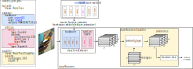

# Model configuration
The specification of a CaBRNet model architecture is stored in a YML file, according to the following specification.
For more examples, see the [ProtoPNet](../../configs/protopnet/model.yml) and 
[ProtoTree](../../configs/prototree/model.yml) configuration files.

As shown below, each CaBRNet model is composed of:

- a [feature extractor](#extractor-configuration) that processes the input image and produces a set of features, 
usually in the form of a 3-dimensional tensor (D, H, W) where:
    - D is the number of (convolutional) channels.
    - H x W represent the size of the image representation after downsampling. In other words, for each image,
the feature extractor produce a HxW map of D-dimensional vectors, called the **feature map**.
- a [classifier](#classifier-configuration) that:
    - implements a set of prototypes that are either specific to a given class, or shared among multiples classes. 
    - computes similarity scores between each vector of the feature map and each prototype, using a similarity layer 
    (*e.g.* based on the L2 distance between vectors in $\mathbb{R}^D$).
    - computes the classification logits based on these distances (*e.g.* using a Decision Tree in ProtoTree).




As illustrated for [ProtoTree](../../src/cabrnet/prototree) or [ProtoPNet](../../src/cabrnet/protopnet), the code for each
type of architecture is regrouped into a dedicated directory and contains:

- a file `decision.py` describing the module in charge of performing the prototype-based classification
- a file `model.py` describing the top-level architecture (combination of the feature extractor and the classifier).

Instructions on how to define a new architecture can be found [here](#implementing-a-new-prototype-based-architecture).

## Extractor configuration
The feature extractor is configured through a dedicated section of the configuration file, 
using the `extractor` keyword. A feature extractor is based on a pre-existing CNN classifier architecture - identified by the `backbone` keyword - where the last layers (in charge of the classification itself) have been removed. 

Additionally, in order to reduce the number of dimensions, it is possible to add a set of additional 
layers using the `add_on` keyword:
```yaml
extractor:
  backbone:
    arch: <FEATURE_EXTRACTOR_ARCH> # Must belong to torchvision.models.list_models()
    weights: <null | path/to/state/dict.pth | WEIGHTS_NAME>
    layer: <LAYER_NAME> # Remove all layers in backbone after this one 
  add_on: # Optional
    init_mode: <XAVIER | PROTOPNET> # Optional: Parameter initialization procedure
    <LAYER_NAME_1>:
      type: <FUNCTION_NAME> # Layer name, as given in torch.nn
      params: # Optional
        <PARAM_NAME_1>: <VALUE>
        <PARAM_NAME_2>: <VALUE>
    <LAYER_NAME_2>:
...
classifier:
```
Notes on the configuration of the backbone:

- `arch`: Currently, CaBRNet only supports backbone architectures that belong to the list given by 
[torchvision.models.list_models()](https://pytorch.org/vision/main/generated/torchvision.models.list_models.html).
- `weights`: The backbone parameters can be either initialized:
    - randomly (`null` keyword).
    - by providing the path to an existing state dictionary.
    - by providing the name of a valid set of pre-trained parameters, as given by 
[torchvision.models.get_model_weights(arch)](https://pytorch.org/vision/main/generated/torchvision.models.get_model_weights.html) (*e.g.* `IMAGENET1K_V1` for ImageNet pre-trained weights).
- `layer`: Since the backbone model is usually a classifier, CaBRNet uses the 
[create_feature_extractor](https://pytorch.org/vision/main/generated/torchvision.models.feature_extraction.create_feature_extractor.html) 
function to automatically remove its deepest layers and to keep only the convolutional layers.

Add-on layers can be added after the backbone in order to reduce the dimensionality of the learned prototypes, 
using the `add_on` keyword. In this case, each layer is identified by a layer name and configured using:

- `type`: Supported layer types can be found in [torch.nn](https://pytorch.org/docs/stable/nn.html).
- `params`: An optional field that contains the information necessary to build the layer.

CaBRNet also supports the (optional) use of special function for the initialization of the add-on layers, 
through the `init_mode` keyword:

- `XAVIER`: used in ProtoTree and based on [nn.init.xavier_normal_](https://pytorch.org/cppdocs/api/function_namespacetorch_1_1nn_1_1init_1a86191a828a085e1c720dbce185d6c307.html)
- `PROTOPNET`: a combination of [nn.init.kaiming_normal_](https://pytorch.org/cppdocs/api/function_namespacetorch_1_1nn_1_1init_1ac8a913c051976a3f41f20df7d6126e57.html) 
for convolutional layers and a static starting configuration for BatchNorm layers. 

## Classifier configuration
The classifier performs the classification based on similarities between the output of the feature extractor and a set
of **prototypes**. Prototype management is specific to each type of model architecture (*e.g.* decision tree in ProtoTree, 
linear layer in ProtoPNet).
```yaml
classifier: 
  module: <MODULE_NAME>
  name: <CLASS_NAME>
  params:
    num_features: 256 # Optional
    <PARAM_2>: <VALUE>
...
```
Note that the parameter `num_features` is optional, as it can be recovered from the output of 
the feature extractor.

## Top-level configuration
The top-level model, that combines the feature extractor and the classifier, is configured as follows:
```yaml
top_arch:
  module: <MODULE>
  name: <CLASS_NAME>
```

# Implementing a new prototype-based architecture
## Defining a new classifier architecture
The module in charge of classification should be placed inside a dedicated file in
`src/cabrnet/<ARCH_NAME>/decision.py` (*e.g.* [src/cabrnet/prototree/decision.py](../../src/cabrnet/prototree/decision.py)).

The following code provides a minimal example on how to define a new classifier.
```python
import torch.nn as nn
import torch
from cabrnet.utils.prototypes import init_prototypes
from cabrnet.utils.similarities import L2Similarities

class ArchNameClassifier(nn.Module):
  
    def __init__(
        self,
        num_classes: int,
        num_features: int,
        proto_init_mode: str = "SHIFTED_NORMAL",
    ) -> None:
        """
        Create a ArchName classifier
        Args:
            num_features: Number of features (size of each prototype)
            num_classes: Number of classes
            proto_init_mode: Init mode for prototypes
            ...
        """
        super(ArchNameClassifier, self).__init__()

        # Sanity check on all parameters
        assert num_classes > 1, f"Invalid number of classes: {num_classes}"
        assert num_features > 0, f"Invalid number of features: {num_features}"

        self.num_classes = num_classes
        self.num_features = num_features
        
        # Init prototypes
        self.prototypes = nn.Parameter(
            init_prototypes(
                num_prototypes=self.num_prototypes, num_features=self.num_features, init_mode=proto_init_mode
            )
        )
        # Example of a L2 based similarity layer
        self.similarity_layer = L2Similarities(
            num_prototypes=self.num_prototypes, num_features=self.num_features
        )

    @property
    def max_num_prototypes(self) -> ...:
        """
        Returns: Maximum number of prototypes (might differ from current number of prototypes due to pruning)
        """
        ...

    @property
    def num_prototypes(self) -> ...:
        """
        Returns: Current number of prototypes
        """
        ...


    def forward(self, features: torch.Tensor) -> ...:
        """
        Perform classification using decision tree
        Args:
            features: Convolutional features from extractor. Shape (N, D, H, W)

        Returns:
            Vector of logits
        """
        similarities = self.similarity_layer(features, self.prototypes)
        
        # Compute classification based on similarity scores
        ...
```

## Defining a new top-module
The module in charge of combining the feature extractor and the classifier should be
placed inside a dedicated file in `src/cabrnet/<ARCH_NAME>/model.py` (*e.g.* [src/cabrnet/prototree/model.py](../../src/cabrnet/prototree/model.py)).
The top-module class should inherit from the generic class [CaBRNet](../../src/cabrnet/generic/model.py), and implements
some mandatory functions as illustrated below.
```python
import torch.nn.functional
from torch.utils.data import DataLoader
from typing import Any, Callable
from tqdm import tqdm
from cabrnet.generic.model import CaBRNet
from cabrnet.utils.optimizers import OptimizerManager
from cabrnet.visualisation.visualizer import SimilarityVisualizer


class ArchName(CaBRNet):
      
    def loss(self, model_output: Any, label: torch.Tensor) -> tuple[torch.Tensor, dict[str, float]]:
        """
        Loss function
        Args:
            model_output: Model output, in this case a tuple containing the prediction and the leaf probabilities
            label: Batch labels

        Returns:
            loss tensor and batch statistics
        """
        loss = ...
        batch_stats = {"accuracy": ...} 
        # Please note that returning batch accuracy is mandatory 
        return loss, batch_stats

    def train_epoch( # Mandatory signature
        self,
        dataloaders: dict[str,DataLoader],
        optimizer_mngr: OptimizerManager,
        device: str = "cuda:0",
        progress_bar_position: int = 0,
        epoch_idx: int = 0,
        verbose: bool = False,
        max_batches: int | None = None,
    ) -> dict[str, float]:
        """
        Train the model for one epoch.
        Args:
            dataloaders: Dictionary of dataloaders
            optimizer_mngr: Optimizer manager
            device: Target device
            progress_bar_position: Position of the progress bar.
            epoch_idx: Epoch index
            max_batches: Max number of batches (early stop for small compatibility tests)
            verbose: Display progress bar

        Returns:
            dictionary containing learning statistics
        """
        self.train()
        self.to(device)
        
        # Training stats
        total_loss = 0.0
        total_acc = 0.0
        
        # Recover dataloader on training data 
        train_loader = dataloaders["train_set"]

        # Show progress on progress bar if needed
        train_iter = tqdm(
            enumerate(train_loader),
            total=len(train_loader),
            leave=False,
            position=progress_bar_position,
            disable=not verbose,
        )
        batch_num = len(train_loader)

        for batch_idx, (xs, ys) in train_iter:
            # Reset gradients and map the data on the target device
            optimizer_mngr.zero_grad()
            xs, ys = xs.to(device), ys.to(device)

            # Perform inference and compute loss
            ys_pred, info = self.forward(xs)
            batch_loss, batch_stats = self.loss((ys_pred, info), ys)

            # Compute the gradient and update parameters
            batch_loss.backward()
            optimizer_mngr.optimizer_step(epoch=epoch_idx)

            # Update global metrics
            batch_accuracy = batch_stats["accuracy"]
            total_loss += batch_loss.item()
            total_acc += batch_accuracy
            
            if max_batches is not None and batch_idx == max_batches:
                # Early stop for small tests and sanity checks
                break

        # Clean gradients after last batch
        optimizer_mngr.zero_grad()

        train_info = {"avg_loss": total_loss / batch_num, "avg_train_accuracy": total_acc / batch_num}
        return train_info

    
    def project(
        self,
        data_loader: DataLoader,
        device: str = "cuda:0",
        verbose: bool = False,
        progress_bar_position: int = 0,
    ) -> dict[int, dict]:
        """
        Perform prototype projection after training
        Args:
            data_loader: Dataloader containing projection data. WARNING: This dataloader must not be shuffled!
            device: Target device
            verbose: Display progress bar
            progress_bar_position: Position of the progress bar.
        Returns:
            dictionary containing projection information for each prototype
        """
        # Original number of prototypes
        max_num_prototypes = self.classifier.max_num_prototypes

        # For each prototype, keep track of:
        #   - the index of the closest projection image
        #   - the coordinates of the vector inside the latent representation of that image
        #   - the corresponding similarity score
        #   - the corresponding vector
        projection_info = {
            proto_idx: {
                "img_idx": -1,
                "h": -1,
                "w": -1,
                "score": 0,
            }
            for proto_idx in range(max_num_prototypes)
        }
        # Perform projection
        ...
        return projection_info
     
    def explain(
        self,
        img_path: str,
        preprocess: Callable,
        visualizer: SimilarityVisualizer,
        prototype_dir_path: str,
        output_dir_path: str,
        device: str,
        exist_ok: bool = False,
        **kwargs,
    ) -> None:
        """Explain the decision for a particular image

        Args:
            img_path: raw original image
            preprocess: preprocessing function
            visualizer: prototype visualizer
            prototype_dir_path: path to directory containing prototype visualizations
            output_dir_path: path to output directory containing the explanation
            device: target hardware device
            exist_ok: silently overwrite existing explanation if any
        """
        ...
    
    def explain_global(
        self,
        prototype_dir_path: str,
        output_dir_path: str,
        **kwargs,
    ) -> None:
        """Explain the global decision-making process

        Args:
            prototype_dir_path: path to directory containing prototype visualizations
            output_dir_path: path to output directory containing the explanations
        """
        ...
```