# Visualizing prototypes and test patches

The method used to visualize prototypes and test patches is a contributing factor to the
self-explaining nature of prototype-based architectures.
In particular, incorrect visualization methods can hide model biases, or suggest model bias when there is none, as shown
in:

- *Srishti Gautam, Marina M.-C. Höhne, Stine Hansen, Robert Jenssen, Michael Kampffmeyer,*
  [This looks More Like that: Enhancing Self-Explaining Models by Prototypical Relevance Propagation](https://www.sciencedirect.com/science/article/pii/S0031320322006513).
  Pattern Recognition, Volume 136, 2023.
- *Romain Xu-Darme, Georges Quénot, Zakaria Chihani, Marie-Christine Rousset*,
  [Sanity checks for patch visualisation in prototype-based image classification](https://openaccess.thecvf.com/content/CVPR2023W/XAI4CV/papers/Xu-Darme_Sanity_Checks_for_Patch_Visualisation_in_Prototype-Based_Image_Classification_CVPRW_2023_paper.pdf).
  2023 IEEE/CVF Conference on Computer Vision and Pattern Recognition Workshops (CVPRW).

CaBRNet uses YML files to specify which method should be used to visualize prototypes and test patches.
Visualizing any image patch requires:

- an *attribution* method that identifies, for a given prototype $P$ and a given image $I$, which pixels in $I$ most
  contribute to the similarity between $I$ and $P$.
- a *viewing* method that presents these pixels in a relevant manner to the user.

```yaml
attribution:
  type: <cubic_upsampling|smoothgrad|saliency|randgrad|prp>
  params:
    <METHOD_PARAM_NAME_1>: <PARAM_VALUE>
...
view:
  type: <crop_to_percentile|bbox_to_percentile|heatmap>
  params:
    <METHOD_PARAM_NAME_1>: <PARAM_VALUE>
...
```

## Attribution methods

CaBRNet currently supports the following attribution methods.

### Cubic up-sampling

This is the method used in the original papers of
both [ProtoPNet](https://proceedings.neurips.cc/paper_files/paper/2019/file/adf7ee2dcf142b0e11888e72b43fcb75-Paper.pdf),
[ProtoTree](https://openaccess.thecvf.com/content/CVPR2021/papers/Nauta_Neural_Prototype_Trees_for_Interpretable_Fine-Grained_Image_Recognition_CVPR_2021_paper.pdf)
and [ProtoPool](https://www.ecva.net/papers/eccv_2022/papers_ECCV/papers/136720346.pdf).
The attribution map is obtained by
up-sampling the similarity map between $I$ and $P$ to the size of $I$, using cubic interpolation.
This method supports the following options:

- `single_location`: only up-sample the location of highest similarity inside the similarity map.
  This option sets all other similarity scores to zero prior to up-sampling.

### Saliency

This method implements the [Saliency](https://arxiv.org/abs/1312.6034) explanation algorithm.
By default, this method computes a sum of the gradients of each location inside the similarity map $S(I,P)$ w.r.t.
to $I$,
weighted by the corresponding similarity scores, i.e.
$A = \sum\limits_{h,w} S_{h,w}(I,P)\times \dfrac{\delta S_{h,w}(I,P)}{\delta I}$

This method supports the following options:

- `single_location`: only compute the gradients at the location of highest similarity inside the similarity map.

### SmoothGrad

This method implements the [SmoothGrad](https://arxiv.org/abs/1706.03825) explanation algorithm.
By default, this method computes a sum of the gradients of each location inside the similarity map $S(I,P)$ w.r.t.
to $I$,
weighted by the corresponding similarity scores, i.e.
$A = \sum\limits_{h,w} S_{h,w}(I,P)\times SG(S_{h,w}(I,P))$
where $SG(S_{h,w}(I,P))=\sum\limits_{i=1}^n\dfrac{\delta S_{h,w}(I+\mathcal{N}(0,\sigma),P)}{\delta I}$.

This method supports the following options:

- `single_location`: only compute the gradients at the location of highest similarity inside the similarity map.
- `noise_ratio`: controls the noise ratio (amount of noise added to each perturbed image).
- `num_samples`: number of perturbed samples per image (per location).

### PRP

This method implements the variant of LRP for prototype-based architectures, as
described [here](https://www.sciencedirect.com/science/article/pii/S0031320322006513),
and supports the following option:

- `single_location`: only compute the gradients at the location of highest similarity inside the similarity map.
- `stability_factor`: stability factor used during relevance propagation

**WARNING**: PRP is only relevant for distance-based architectures. In particular, it is **not** applicable to PIPNet.

### Rand-Grads

This method returns random attributions and constitutes a baseline for various metrics evaluating the
quality of attribution methods.

### Post-processing gradients

Additionally, SmoothGrad, Saliency, RandGrad and PRP offer a post-processing capability that normalizes and smooths the
gradients,
using the following options:

- `polarity`: keep only `positive` or `negative` gradients, or their `absolute` value.
- `gaussian_ksize`: apply a Gaussian filter with a kernel of a given size.
- `normalize`: apply min-max normalization
- `grads_x_input`: multiply the attribution map (gradients) and the image element-wise.
- `similarity_threshold`: when `single_location` is set to `False`, this threshold $t$ is used to speed-up computations
  by
  filtering out locations with a similarity score lower than this value.

## Viewing methods

CaBRNet supports the following methods for visualizing the most contributing pixels to the similarity
between image $I$ and prototype $P$.

### Bounding-box to percentile

This method draws a bounding-box around the most contributing pixels, according to a given
threshold, given as a percentile of attribution. More precisely, **this method assumes that
the activation map has been normalized between 0 and 1** (using min-max normalization), then
draws a bounding box encompassing all pixels with an attribution value higher than `1-percentile`,
e.g. for `percentile=0.8`, the bounding-box encompasses all pixels with attribution values greater than 0.2.

This methods supports the following options:

- `percentile`: sets the selection threshold for pixels, based on their attribution values.
- `thickness`: thickness of the bounding-box, in pixels.

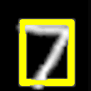

### Crop to percentile

Rather than drawing a bounding-box around the most contributing pixels, this method crops the
image based on this bounding-box, using the `percentile` option as in
the [previous method](#bounding-box-to-percentile).

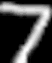

### Heatmap

Alternatively, important pixels can be visualized using the `heatmap` method.

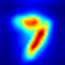

Additionally, using the `percentile` option as in the [previous methods](#bounding-box-to-percentile), it is possible to
overlay a bounding box
to the heatmap.

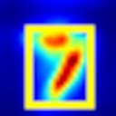

Finally, using the `overlay` option, the heatmap is overlaid onto the original image.

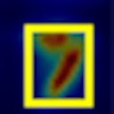

# Visualizing the feature space

Case-based reasoning networks operate based on the relative distance between various points (vectors) in the
convolutional space of the [feature extractor](model.md#extractor-configuration) -
also called **latent space**. This section aims at describing how
CaBRNet proceeds to generate a 2D visualization of this D-dimensional space.

## Feature vector selection

Visualizing the latent space of a CaBRNet model means visualizing the relative distance between different vectors in
that space. By default, the `cabrnet show_latent_space` [application](cabrnet.md#visualizing-the-feature-space)
plots ALL vectors corresponding to each image of the
*training set* provided in the command line, *i.e.* for a $H\times W \times D$ representation of an image,
all $H\times W$
vectors of all images are plotted.
To reduce the amount of vectors considered, CaBRNet offers two solutions:

- the `--sampling-ratio` [option](cabrnet.md#sanity-check) allows to reduce the number of images to process
- the `--similarity-threshold` option allows to plot only feature vectors that have a similarity score greater than
  a given threshold with at least one of the selected prototypes (see below).

In conjunction with the `--similarity-threshold` option, it is possible to consider only
prototypes belonging to a given class, using the `--plot-class` option. In other words, for
a similarity threshold $t$ and a class $c$, only feature vectors with a similarity greater than $t$ with
at least one prototype related to class $c$ will be plotted.

## Reducing the dimensionality

Visualizing the latent space also requires an algorithm to reduce the dimensionality of the feature vectors from
$D$ to 2. The `--algorithm` option offer a choice between:

- Principal Component Analysis (PCA)
- t-Distributed Stochastic Neighbor
  Embedding ([tSNE](https://scikit-learn.org/stable/modules/generated/sklearn.manifold.TSNE.html))
- Pairwise Controlled Manifold Approximation ([PaCMAP](https://github.com/YingfanWang/PaCMAP))

## Generating a visualization of the space

After dimensionality reduction, and by default, the
`cabrnet show_latent_space` [application](cabrnet.md#visualizing-the-feature-space)
generates an image representing the feature space, assigning colors to feature vectors based on the class
of their corresponding images. However, for large datasets with hundreds of classes, it may be hard to separate
points from different classes. Hence, the `--show-class` option allows to single out a particular
class, putting all feature vectors belonging to a different class to the same color.

NOTE: if provided, the `--plot-class` option overrides the value of the `--show-class` option.

## Examples

Examples the latent space of a ProtoPNet model trained on MNIST.

```
cabrnet show_latent_space -c runs/mnist_protopnet/final/ \
    -a PCA -o mnist_space_pca.png -v --sampling-ratio 10
```

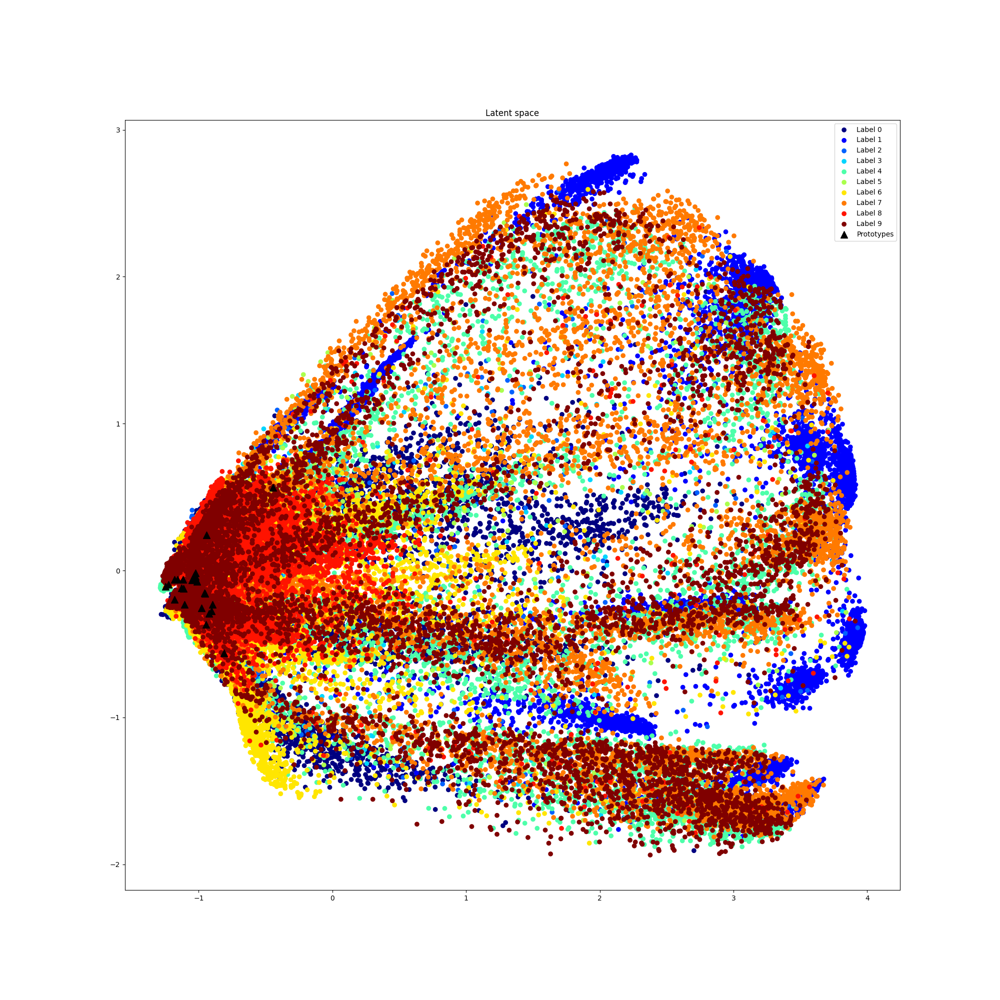

```
cabrnet show_latent_space -c runs/mnist_protopnet/final/ \
    -a tSNE -o mnist_space_tsne.png -v --sampling-ratio 10
```

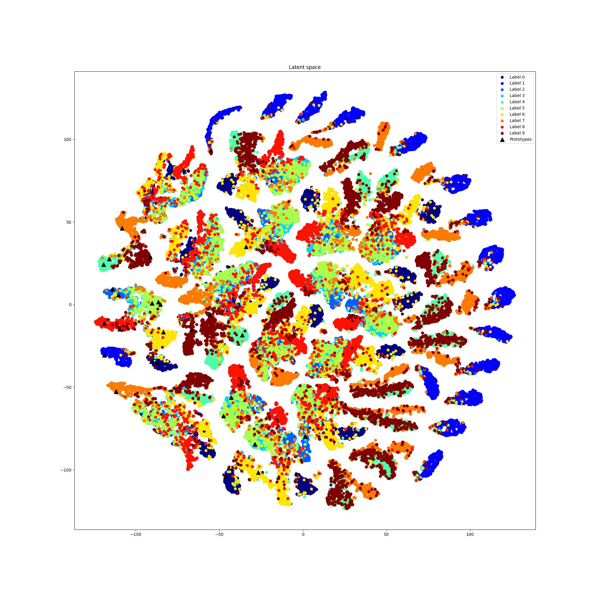

```
cabrnet show_latent_space -c runs/mnist_protopnet/final/ \
    -a PaCMAP -o mnist_space_pacmap.png -v --sampling-ratio 10
```

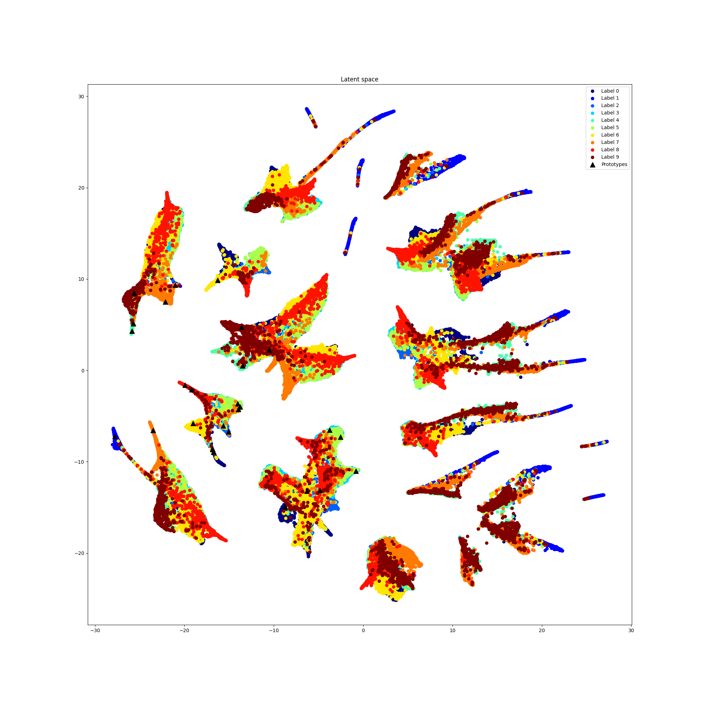

```
cabrnet show_latent_space -c runs/mnist_protopnet/final/ \
    -a PaCMAP -o mnist_space_pacmap_s5.png -v --sampling-ratio 10 \
    --show-class 5
```

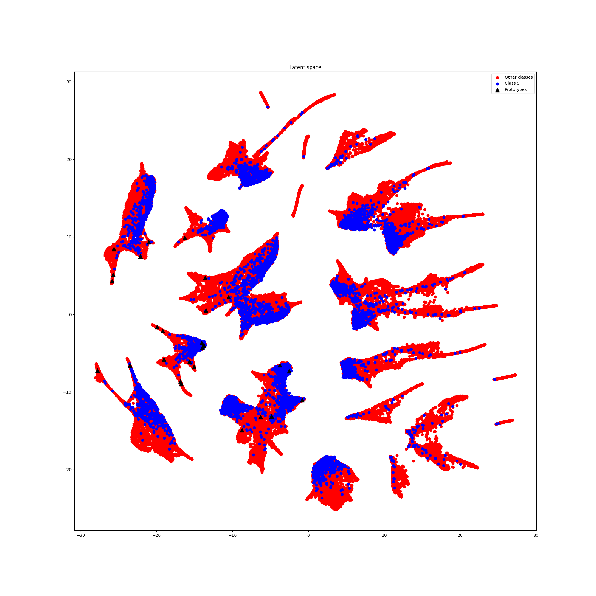

```
cabrnet show_latent_space -c runs/mnist_protopnet/final/ \
    -a PaCMAP -o mnist_space_pacmap_c5.png -v --sampling-ratio 10 \
    --plot-class 5
```

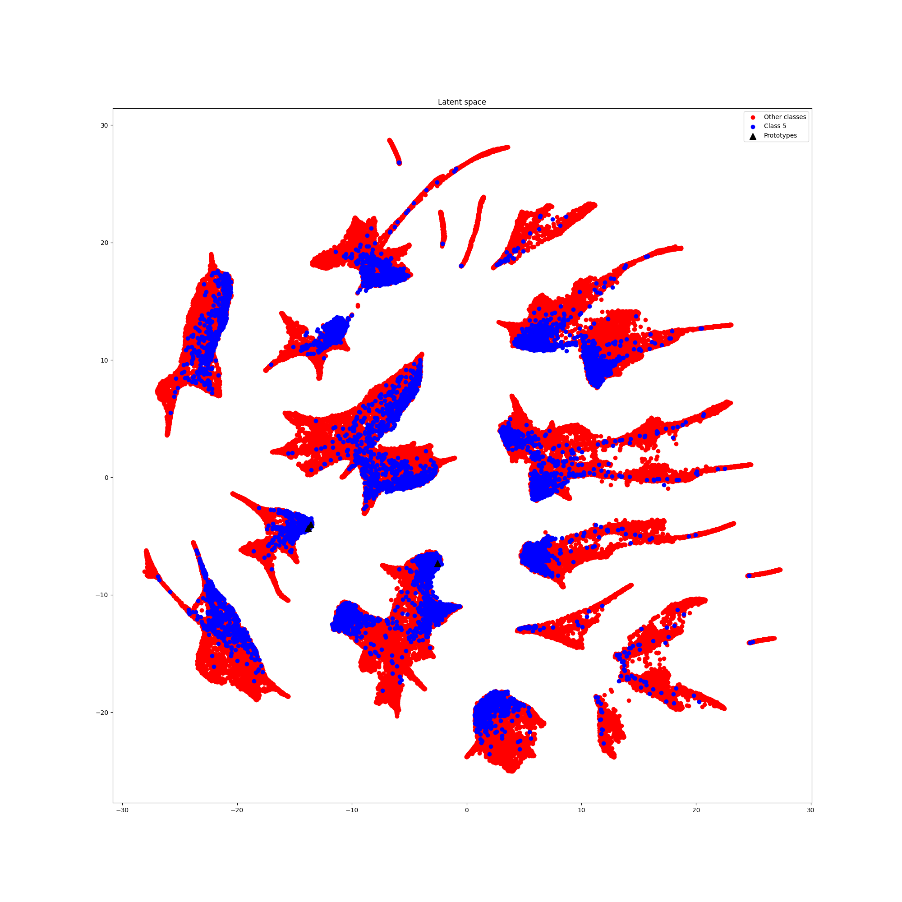

```
cabrnet show_latent_space -c runs/mnist_protopnet/final/ \
    -a PaCMAP -o mnist_space_pacmap_c5t.png -v \
    --plot-class 5 --similarity-threshold 4.5
```

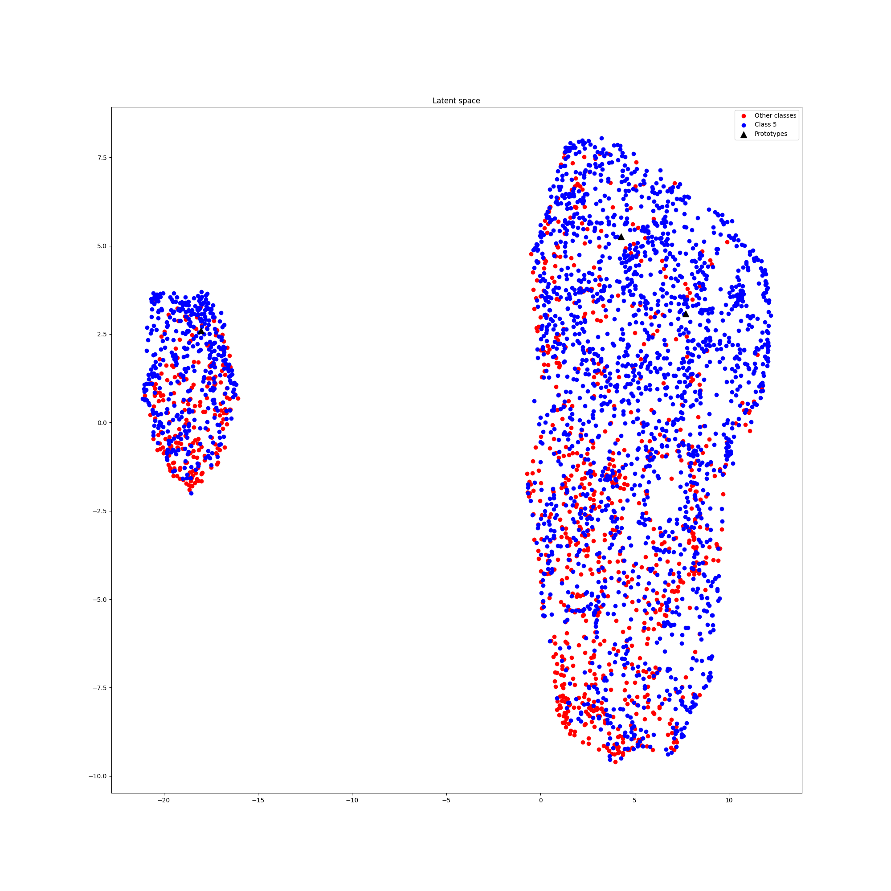
