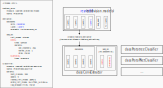

# Model configuration
The specification of a CaBRNet model architecture is stored in a YML file, according to the following specification.
For more examples, see the [ProtoPNet](../../../configs/protopnet/model.yml) and 
[ProtoTree](../../../configs/prototree/model.yml) configuration files.





```yaml
extractor:
  backbone:
    arch: <FEATURE_EXTRACTOR_ARCH> # Must belong to torchvision.models.list_models()
    weights: <null | path/to/state/dict.pth | WEIGHTS_NAME>
    layer: <LAYER_NAME> # Remove all layers in backbone after this one 
  add_on: # Optional
    init_mode: <XAVIER | PROTOPNET> # Optional: Parameter initialization procedure
    <LAYER_NAME>:
      type: <FUNCTION_NAME> # Layer name, as given in torch.nn
      params: # Optional
        <PARAM_NAME_1>: <VALUE>
        <PARAM_NAME_2>: <VALUE>
...
classifier:
```
Notes on the configuration of the backbone:
- `arch`: Currently, CaBRNet only supports backbone architectures that belong to the list given by 
[torchvision.models.list_models()](https://pytorch.org/vision/main/generated/torchvision.models.list_models.html).
- `weights`: The backbone parameters can be either initialised:
  - randomly (`null` keyword)
  - by providing the path to an existing state dictionary
  - by providing the name of a valid set of pre-trained parameters, as given by 
[torchvision.models.get_model_weights(arch)](https://pytorch.org/vision/main/generated/torchvision.models.get_model_weights.html)
- `layer`: Since the backbone model is usually a classifier, CaBRNet uses the 
[create_feature_extractor](https://pytorch.org/vision/main/generated/torchvision.models.feature_extraction.create_feature_extractor.html) 
function to automatically remove its deepest layers and to keep only the convolutional layers.
Add-on layers can be added after the backbone in order to reduce the dimensionality of the learned prototypes:
- TODO `type`: [torch.nn](https://pytorch.org/docs/stable/nn.html)